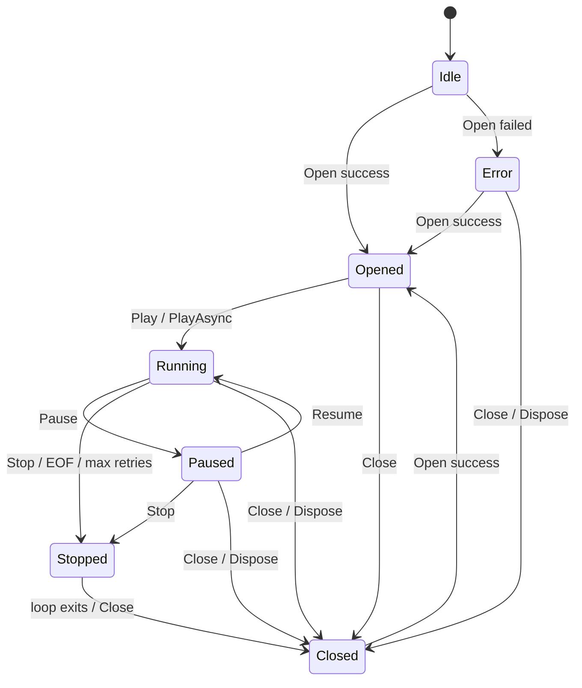

# VideoLoader 需求规格说明书

## 1. 文档目的

本文档定义 `VideoLoader` 模块的正式功能规格、领域契约与实现约束。该模块的核心职责是从视频文件、网络视频流或其他可解码视频源中抽取视频帧，将帧图像转换为 OpenCV `Mat`，封装为 `Frame`，并推入后续 `VideoFrameBuffer`，供检测、跟踪、区域计算、算法模块与显示链路消费。

本文档覆盖以下代码范围：

- `src/3.Domain/Perceptron.Domain/Abstraction/MediaLoader/`
- `src/5.Component/MediaLoader.OpenCV/`
- `spec/3.Domain/Abstraction/IVideoLoader-Spec.md`

未来可新增 `MediaLoader.FFMpeg`、`MediaLoader.GStreamer` 或其他解码后端，但所有后端必须遵守同一 `IVideoLoader` 领域契约，并输出持有 `OpenCvSharp.Mat` 的 `Frame`。

## 2. 模块边界

### 2.1 职责范围

`VideoLoader` 负责：

- 打开并管理视频源连接，包括本地文件、视频流 URI 和实现支持的设备源。
- 读取、解码、跳帧和重连。
- 将解码后的图像转换为 CPU 可访问的 `OpenCvSharp.Mat`。
- 生成 `Perceptron.Domain.Entity.VideoStream.Frame`，写入 `IVideoFrameBuffer`。
- 可选触发帧回调，用于预览、诊断或低延迟旁路消费。
- 暴露视频规格 `VideoSpecs`、加载状态 `VideoLoaderState` 和当前配置。

### 2.2 非职责范围

`VideoLoader` 不负责：

- 目标检测、跟踪、区域判断、事件生成或标注渲染。
- `VideoFrameBuffer` 的容量策略、阻塞策略、丢帧策略和空白帧策略。
- 长期保存视频帧或快照。
- 为不同算法复制或裁剪图像。需要长期持有帧的消费者必须通过 `Frame.Retain()` 和 `Frame.Dispose()` 管理生命周期。

## 3. 架构定位

`IVideoLoader` 是领域层面的视频输入抽象。组件层通过不同实现适配具体解码技术：

| 层级 | 当前实现 | 未来扩展 | 约束 |
| :--- | :--- | :--- | :--- |
| 领域抽象 | `IVideoLoader`、`VideoLoaderOptions`、`VideoLoaderState` | 保持稳定 | 面向业务和管线，不暴露具体解码流程 |
| 输出实体 | `Frame`、`VideoSpecs` | 保持稳定 | `Frame.Scene` 必须为 `OpenCvSharp.Mat` |
| 组件实现 | `MediaLoader.OpenCV.VideoLoader` | `MediaLoader.FFMpeg.VideoLoader` 等 | 可替换后端，但对上层契约一致 |
| 下游缓冲 | `IVideoFrameBuffer` | 不变 | 接收 `Frame`，负责队列化与消费解耦 |

`OpenCvSharp.Mat` 是本模块的标准输出类型。即使未来后端不使用 OpenCV 进行解码，也必须在输出边界转换为 `Mat`，以保持后续算法和缓冲区链路稳定。

## 4. 接口契约

### 4.1 `IVideoLoader`

`IVideoLoader` 必须提供以下能力：

| 成员 | 类型 | 说明 |
| :--- | :--- | :--- |
| `SourceId` | `string` | 视频源唯一标识，必须非空。 |
| `VideoUri` | `string` | 当前打开的视频源 URI 或路径。未打开时为空字符串。 |
| `Specs` | `VideoSpecs` | 视频源规格。`Open` 成功后必须有效。 |
| `VideoStride` | `int` | 抽帧步进。值为 `n` 表示每 `n` 个源帧输出 1 帧。 |
| `Options` | `VideoLoaderOptions` | 当前生效配置，必须反映实际运行配置。 |
| `State` | `VideoLoaderState` | 当前生命周期状态。 |
| `AttachBuffer` | 方法 | 绑定输出缓冲区。参数为 `null` 时必须抛出 `ArgumentNullException`。 |
| `Open` | 方法 | 打开视频源并读取元数据。成功返回 `true`，失败返回 `false`。 |
| `Close` | 方法 | 关闭视频源并释放解码资源。 |
| `Play` / `PlayAsync` | 方法 | 开始抽帧循环。 |
| `Pause` / `Resume` | 方法 | 暂停或恢复抽帧循环。 |
| `Stop` / `StopAsync` | 方法 | 请求停止抽帧循环。 |
| `Seek` | 方法 | 对可随机访问视频源进行定位。 |
| `SetFrameCallback` / `UnsetFrameCallback` | 方法 | 注册或注销帧回调。 |
| `Dispose` | 方法 | 释放解码器、池化资源和后台任务资源。 |

### 4.2 `VideoLoaderOptions`

通用配置必须包含：

| 配置 | 类型 | 默认值 | 说明 |
| :--- | :--- | :--- | :--- |
| `SourceId` | `string` | `Test-Camera` | 视频源标识。当前位于 `VideoLoaderSettings`。 |
| `VideoUri` | `string` | 空字符串 | 视频源路径或 URI。当前由管线调用 `Open` 传入。 |
| `VideoStride` | `int` | `1` | 抽帧步进，必须大于 0。 |
| `Loop` | `bool` | `false` | 文件源到达末尾后是否循环。 |
| `MaxRetries` | `int` | `3` | 流读取失败后的最大重连次数，必须大于等于 0。 |
| `RetryDelayMs` | `int` | `1000` | 重连等待时间，单位毫秒，必须大于等于 0。 |

后端相关配置应与通用配置分层管理：

| 当前配置 | 当前类型 | 目标约束 |
| :--- | :--- | :--- |
| `VideoCaptureApi` | `OpenCvSharp.VideoCaptureAPIs` | 仅适用于 OpenCV 后端，不应作为所有后端必需配置。 |
| `AccelerationType` | `OpenCvSharp.VideoAccelerationType` | 仅适用于 OpenCV 后端。FFmpeg 后端应使用自己的硬件加速配置。 |
| `VideoAccelerationDeviceId` | `int` | 可作为通用设备索引保留，但语义需由后端解释。 |

为支持未来 FFmpeg 后端，建议将 `VideoLoaderOptions` 拆分为通用选项和后端扩展选项，或增加后端私有配置字典。领域层可以继续引用 `OpenCvSharp.Mat` 作为输出类型，但不应强依赖 OpenCV 的采集 API 枚举。

### 4.3 `VideoLoaderState`

状态定义：

| 状态 | 含义 |
| :--- | :--- |
| `Idle` | 已构造，尚未打开视频源。 |
| `Opened` | 视频源已打开，元数据已读取，尚未进入抽帧循环。 |
| `Running` | 正在抽帧、封装并输出帧。 |
| `Paused` | 抽帧循环挂起，资源仍保持打开。 |
| `Stopped` | 已收到停止请求，抽帧循环准备退出或已经退出。 |
| `Closed` | 视频源和解码资源已释放。 |
| `Error` | 打开、读取或重连失败，并且无法继续。 |

目标状态流转：

`Stop` 必须可从 `Running` 和 `Paused` 状态生效。`Close` 和 `Dispose` 必须幂等。

## 5. 输出帧规范

### 5.1 `Frame` 内容

每个输出帧必须满足：

- `Frame.SourceId` 等于当前 loader 的 `SourceId`。
- `Frame.FrameId` 是当前视频源内的单调递增帧位置。开启 `VideoStride` 后，输出帧的 `FrameId` 可以不连续。
- `Frame.OffsetMilliSec` 是源视频时间轴上的毫秒偏移。无法获取时必须使用 `0`，不得使用负数。
- `Frame.UtcTimeStamp` 由 `Frame` 构造时记录。
- `Frame.Scene` 必须为非空 `OpenCvSharp.Mat`。
- `Frame.Annotation` 必须与帧尺寸、`SourceId` 和时间戳一致。

### 5.2 `Mat` 格式

标准输出格式为 CPU 可访问的 `OpenCvSharp.Mat`：

- 默认颜色空间应为 BGR。
- 默认类型应为 `MatType.CV_8UC3`。
- `Mat.Width` 必须等于 `Specs.Width`，`Mat.Height` 必须等于 `Specs.Height`。
- 后端如果因配置输出灰度、BGRA、浮点或 GPU 下载后的特殊格式，必须在选项和文档中显式声明，并保证下游模块能够识别。
- `Mat` 的内存连续性不作为契约，消费者不得依赖 `Mat.IsContinuous()`。

FFmpeg 后端必须在输出前完成像素格式转换，例如将 `AVFrame` 的 YUV、NV12、P010 等格式转换为 BGR `Mat`。

### 5.3 所有权与释放

`VideoLoader` 是 `Frame` 与 `Mat` 的生产者。输出后的所有权规则如下：

- 推入 `IVideoFrameBuffer` 表示将该帧的一份使用权交给缓冲区。
- 调用帧回调表示将该帧的一份使用权交给回调消费者。
- 如果同一个 `Frame` 同时推入缓冲区并发送给回调，loader 必须确保每个独立消费者都有明确的引用计数，或使用克隆帧避免共享所有权冲突。
- 消费者如果异步持有 `Frame`，必须先调用 `Frame.Retain()`，处理完成后调用 `Frame.Dispose()`。
- `MatPool` 或等价池化机制只能在所有消费者释放后回收 `Mat`。

## 6. 行为规范

### 6.1 打开视频源

`Open(uri)` 必须：

- 拒绝空字符串或空白 URI。
- 对本地文件源优先检查文件存在性。
- 关闭已有视频源后再打开新源。
- 成功后填充 `VideoUri`、`Specs`，重置内部帧计数和重试计数，并将状态置为 `Opened`。
- 失败后释放已创建资源，将状态置为 `Error`，返回 `false`。

本地文件路径可以是普通路径或 `file://` URI。网络视频流可以是实现支持的 URI，例如 `rtsp://`、`http://` 或 `udp://`。

### 6.2 抽帧循环

`Play` 和 `PlayAsync` 必须：

- 仅在视频源已打开时进入 `Running`。
- 循环执行抓取、步进过滤、图像转换、帧封装和输出。
- 遇到 `Paused` 时停止读取源帧，但保持资源打开。
- 遇到 `Stop`、取消令牌、文件结束或不可恢复错误时退出循环。
- 退出循环后释放解码资源，最终状态为 `Closed`，除非实现明确支持停止后保持打开。

`debugMode` 和 `debugFrameCount` 仅用于测试和诊断，不应作为生产路径依赖。

### 6.3 步进抽帧

`VideoStride = n` 时：

- loader 每读取 `n` 个源帧输出 1 帧。
- 被跳过的帧不得进入缓冲区，也不得触发帧回调。
- `FrameId` 仍应表示源视频位置，而不是输出序号。

### 6.4 文件结束与循环

对于本地文件源：

- 到达文件结束且 `Loop = false` 时，loader 停止并关闭。
- 到达文件结束且 `Loop = true` 时，loader 定位回起点继续读取。
- 循环后 `FrameId` 可回到文件起始位置，但同一运行周期内应能通过 `OffsetMilliSec` 或外部上下文区分循环段。

对于网络流：

- `Loop` 不生效。
- 读取失败应进入重连策略。

### 6.5 重连策略

流读取失败时：

- loader 按 `MaxRetries` 和 `RetryDelayMs` 尝试重建解码器。
- 第一次失败可以快速重试，后续重试应遵守延迟配置。
- 重连成功后继续输出新帧。
- 对本地文件源，重连后应尽量恢复到失败前位置。
- 超过最大重试次数后进入 `Error` 或 `Stopped`，并释放资源。

### 6.6 定位

`Seek(long frameId)` 和 `Seek(TimeSpan timestamp)`：

- 仅要求支持可随机访问的视频源，至少包括本地文件。
- 对实时流或不支持定位的源必须返回 `false`。
- 参数非法时必须返回 `false`，不得修改当前读取位置。
- 定位成功后，后续输出从新位置开始，并同步更新内部帧计数。

### 6.7 异步与取消

`PlayAsync(CancellationToken)` 必须：

- 在后台执行抽帧循环。
- 响应调用方传入的 `CancellationToken`。
- 不吞掉不可恢复异常。实现可以记录日志，但任务必须能让调用方观察失败。

`StopAsync()` 必须请求停止，并在抽帧循环实际退出后完成，或清晰声明它只提交停止请求。

## 7. 后端实现要求

### 7.1 OpenCV 后端

`MediaLoader.OpenCV.VideoLoader` 使用 `OpenCvSharp.VideoCapture` 作为解码器。它必须：

- 支持本地文件和 OpenCV 可打开的视频流 URI。
- 将 `VideoCapture` 读取到的图像封装为标准 `Frame`。
- 对硬件加速、Capture API 等 OpenCV 私有配置采用最佳努力策略；如果配置由于库限制无法生效，必须在日志或状态中可见。
- 释放 `VideoCapture`、`MatPool` 和取消令牌资源。

### 7.2 FFmpeg 后端

未来 `MediaLoader.FFMpeg.VideoLoader` 必须：

- 实现同一 `IVideoLoader` 接口。
- 支持 FFmpeg demux、decode、seek、reconnect 和 pixel format conversion。
- 在输出边界生成 `OpenCvSharp.Mat`，默认 BGR `CV_8UC3`。
- 不要求使用 OpenCV 进行解码，但不得改变下游 `Frame`、`IVideoFrameBuffer` 和算法模块的输入契约。
- 对 FFmpeg 私有配置使用后端扩展配置，不污染通用领域契约。

## 8. 当前实现评审摘要

当前 `MediaLoader.OpenCV` 已覆盖基础功能：打开源、读取帧、步进抽帧、回调、推入缓冲区、Seek、Loop、重连和 Mat 池化。但存在以下需要在后续实现中修正或固化的风险：

| 编号 | 风险 | 影响 | 规格要求 |
| :--- | :--- | :--- | :--- |
| R1 | `VideoLoaderOptions` 位于领域层，却直接依赖 `OpenCvSharp.VideoCaptureAPIs` 和 `VideoAccelerationType`。 | FFmpeg 后端会被 OpenCV 采集 API 污染。 | 分离通用配置与后端私有配置。 |
| R2 | OpenCV 实现解析了 `VideoStride`、`Loop`、`MaxRetries`、`RetryDelayMs`，但 `Options` 未同步这些值。 | `Options` 无法真实反映当前运行配置。 | `Options` 必须包含并暴露实际生效配置。 |
| R3 | 当前 OpenCV TODO 表明 `VideoCaptureApi` 和 `VideoCapturePara` 暂未实际应用。 | 配置宣称可用，但运行时可能无效。 | 后端无法应用配置时必须显式记录，并在规格中标注为最佳努力。 |
| R4 | `PlayAsync(CancellationToken)` 未使用调用方传入的取消令牌。 | 上层无法可靠取消后台抽帧任务。 | 异步播放必须响应外部取消。 |
| R5 | `Stop()` 仅在 `Running` 状态生效，暂停状态下无法停止。 | 暂停后可能无法通过 Stop 退出。 | `Stop` 必须支持 `Running` 和 `Paused`。 |
| R6 | 同一 `Frame` 同时推入缓冲区和回调时，引用计数所有权不够明确。 | 回调提前 Dispose 可能导致缓冲区中的 `Mat` 被回收。 | 每个独立消费者必须拥有独立引用或克隆帧。 |
| R7 | `MatPool.Rent` 调用参数应遵循 `rows = height`、`cols = width`。 | 宽高传反会导致池化命中错误或额外重分配。 | 输出 `Mat` 尺寸必须与 `Specs` 一致。 |
| R8 | `Open` 对空 URI、本地缺失文件、解码器打开失败的状态处理不完全一致。 | 调用方难以依据 `State` 判断失败原因。 | 任意打开失败均应进入 `Error`。 |
| R9 | 日志中视频 id 参数传值疑似错误。 | 诊断时 SourceId 与 Uri 混淆。 | 日志必须准确输出 `SourceId` 和 `VideoUri`。 |

## 9. 验收标准

### 9.1 功能验收

- 能打开有效本地视频文件，`Open` 返回 `true`，`Specs` 与源视频匹配，状态为 `Opened`。
- 无效 URI、缺失文件或无法打开的流必须返回 `false`，状态为 `Error`。
- `Play` 能持续输出 `Frame`，且每帧 `Scene` 是非空 `OpenCvSharp.Mat`。
- 绑定 `IVideoFrameBuffer` 后，每个输出帧都必须调用 `PushFrame`。
- 注册回调后，每个输出帧都必须触发回调。
- `VideoStride` 能减少输出帧数量，输出帧 `FrameId` 对应源视频位置。
- 本地文件支持按帧和按时间定位。
- `Pause` 停止读取新帧，`Resume` 恢复读取，`Stop` 可从运行和暂停状态退出。
- `PlayAsync` 可通过 `CancellationToken` 或 `StopAsync` 终止。

### 9.2 资源验收

- `Close` 和 `Dispose` 可重复调用且不抛出异常。
- 抽帧结束后 `VideoCapture` 或后端解码器资源被释放。
- `Mat` 不泄漏、不提前回收、不在消费者仍持有时复用。
- 缓冲区满或帧被丢弃时，丢弃帧必须释放对应引用。

### 9.3 扩展验收

- 新增 FFmpeg 后端不要求修改 `AnalysisPipeline`、`IVideoFrameBuffer`、检测器或算法模块。
- FFmpeg 后端输出的 `Frame.Scene` 与 OpenCV 后端输出一致，默认 BGR `CV_8UC3`。
- 后端私有配置不会破坏通用 `IVideoLoader` 契约。

## 10. 建议测试清单

- `Open_WithValidLocalFile_ShouldPopulateSpecs`
- `Open_WithMissingFile_ShouldReturnFalseAndSetError`
- `Play_WithBuffer_ShouldPushMatFrames`
- `Play_WithCallback_ShouldInvokeCallbacks`
- `Play_WithBufferAndCallback_ShouldRespectFrameOwnership`
- `PlayAsync_WithCancellationToken_ShouldStop`
- `Stop_WhenPaused_ShouldExitLoop`
- `Play_WithStride_ShouldOutputExpectedSourceFrameIds`
- `Seek_LocalFile_ByFrameAndTimestamp_ShouldWork`
- `Seek_Stream_ShouldReturnFalse`
- `Loop_LocalFile_ShouldRestartFromBeginning`
- `Reconnect_Stream_ShouldRetryAndRecover`
- `Dispose_ShouldReleaseDecoderAndMatPool`
- `FFmpegBackend_ShouldOutputOpenCvMat`

