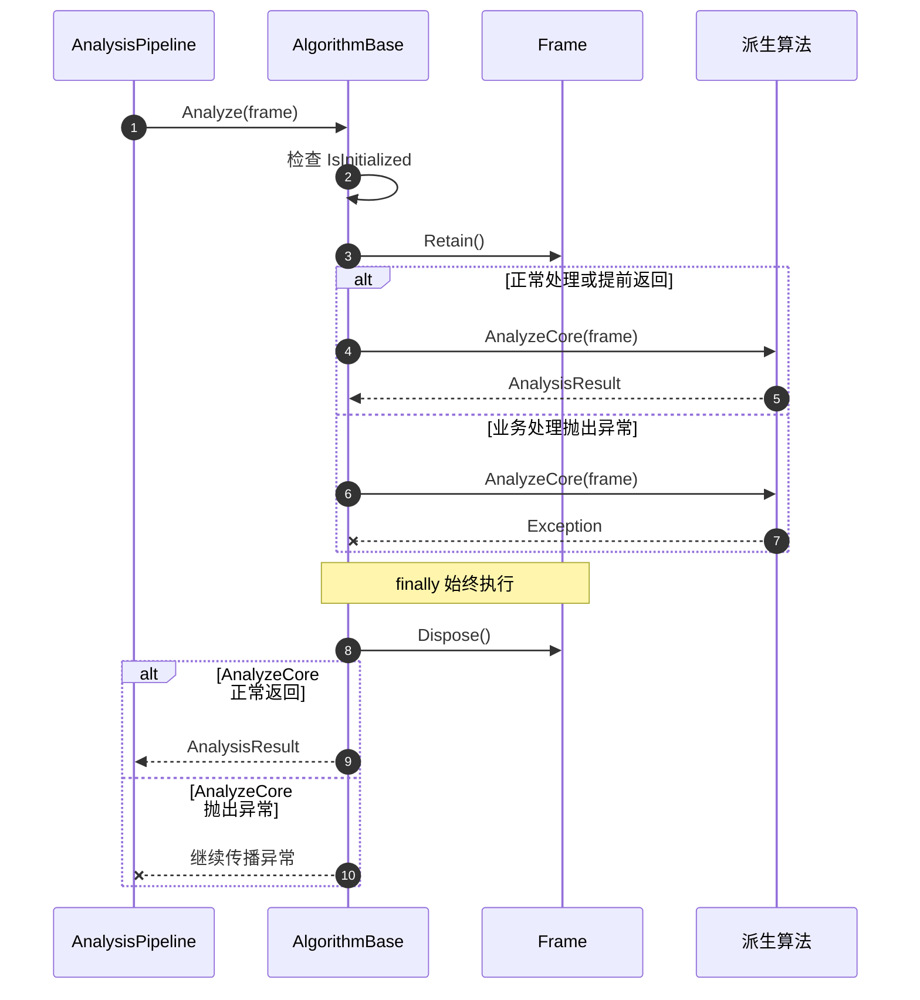
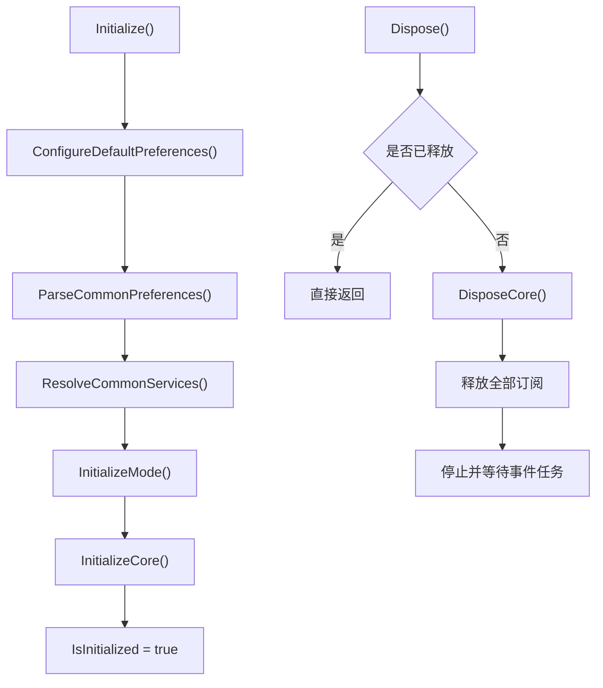
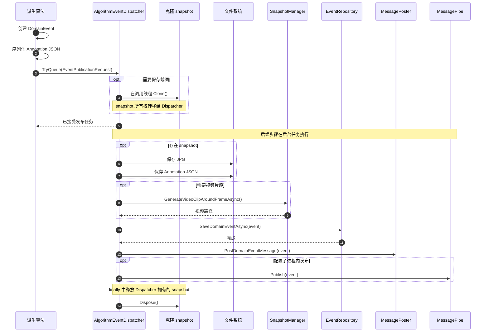
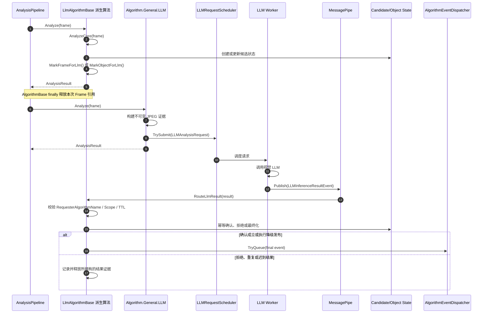
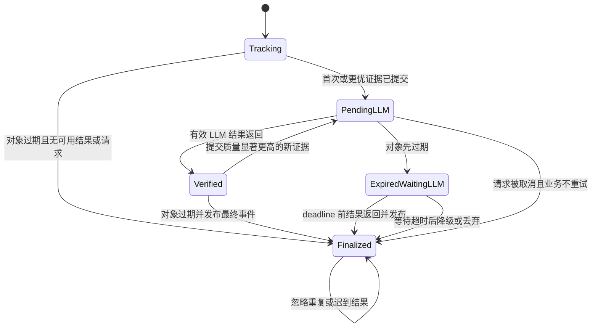

# 算法模块模板方法与视觉 LLM 异步确认架构设计

## 实施状态

截至 2026-06-09，本规范定义的阶段 0 至阶段 8 已完成。当前代码以 `AlgorithmBase` 固化公共生命周期，以 `LlmAlgorithmBase` 隔离 LLM 请求方职责，并已删除过渡期兼容入口。迁移结果由 `Algorithm.Common.Tests` 中的生命周期、事件调度、订阅释放、LLM 路由、重复结果、错误结果和 snapshot 所有权测试覆盖。

## 1. 背景

当前项目是一个 AI 视频分析流水线，主要使用传统视觉模型，尤其是基于 YOLO 的目标检测模型，对视频帧中的目标对象进行识别，然后再执行后续业务分析算法。

传统模型链路的优势是速度足够快：

- 常规帧处理期望控制在 40 ms 以内。
- 复杂业务算法可以通过跳帧降低计算压力。
- 下游业务算法依赖 `Frame`、`DetectedObject`、目标跟踪 ID、标注信息和领域事件。

算法模块当前分为两类：

- 同步算法：使用传统视觉模型或业务规则实时分析帧，直接生成标注和业务事件。
- 异步 LLM 算法：先由传统算法筛选候选证据，再将整帧、对象裁剪或序列图像提交给视觉 LLM，并在结果返回后完成确认、拒绝或降级。

这两类算法虽然业务判断不同，但都重复执行相似的基础流程：

```text
初始化配置与依赖
-> 接收并管理 Frame 生命周期
-> 执行业务分析
-> 生成实时标注
-> 创建业务事件
-> 固化截图、标注和视频证据
-> 持久化事件
-> 投递外部消息
-> 发布进程内事件
-> 释放订阅和非托管资源
```

当前主要存在两组问题：

1. 公共生命周期和事件发布流程分散在各个派生算法中，产生重复代码、资源泄漏和行为不一致。
2. 传统模型可能出现误报和漏报，需要使用视觉 LLM 作为二次确认层；但 LLM 推理通常需要 1-6 秒，不能阻塞实时流水线，还必须正确关联历史帧、对象和候选事件。

本文档给出统一设计：

- 使用 Template Method 固定算法生命周期和帧处理骨架。
- 使用独立事件调度器统一截图、标注、视频、持久化和发布。
- 使用 `LlmAlgorithmBase` 隔离同步算法与 LLM 请求方算法。
- 保留不可变证据、候选事件和异步结果归并设计。

具体实施任务、迁移顺序和验收清单见同目录的 [AlgorithmRefactoringPlan.md](AlgorithmRefactoringPlan.md)。

## 2. 现有参考实现

相关代码路径：

- `src/6.Algorithm/Algorithm.Common/AlgorithmBase.cs`
- `src/6.Algorithm/Algorithm.Common/Event/`
- `src/6.Algorithm/Algorithm.General.MotionDetection/`
- `src/6.Algorithm/Algorithm.General.ObjectDensity/`
- `src/6.Algorithm/Algorithm.General.ObjectOccurrence/`
- `src/6.Algorithm/Algorithm.General.RegionAccess/`
- `src/6.Algorithm/Algorithm.Ship.Labels/`
- `src/6.Algorithm/Algorithm.Ship.LabelsByLLM/`
- `src/6.Algorithm/Algorithm.General.LLM/`
- `src/6.Algorithm/Algorithm.General.ObjectOccurrenceByLLM/`
- `src/6.Algorithm/Algorithm.General.SequenceToImage/`
- `src/2.Service/Perceptron.Service/Pipeline/VideoFrameSlideWindow.cs`

当前同步算法的典型实现方式：

1. 派生类重写 `Initialize()`，解析业务配置并在结尾调用 `base.Initialize()`。
2. 派生类重写 `Analyze(Frame frame)`。
3. 每个 `Analyze()` 手工调用 `frame.Retain()` 和 `frame.Dispose()`。
4. 业务算法直接生成标注和领域事件。
5. 各派生类自行使用 `Task.Run` 保存图片、标注、视频和事件。
6. 派生类重写 `Dispose()`，释放模型和订阅，并负责调用 `base.Dispose()`。

当前 LLM 算法协作方式：

1. 业务算法判断是否需要 LLM 分析。
2. 业务算法在 `Frame` 或 `DetectedObject` 上设置属性：
   - `LLMAnalysis`
   - `LLMAnalysisType`
   - `LLMAnalysisPrompt`
3. 后置的 `Algorithm.General.LLM` 在流水线中识别这些属性。
4. `Algorithm.General.LLM` 将推理任务加入异步队列。
5. LLM 推理完成后发布 `LLMInferenceResultEvent`。
6. 业务算法订阅并消费 LLM 结果事件，更新自身状态或生成业务事件。

当前实现中已经存在一些正确的基础能力：

- 帧级任务按 `SourceId` 保留最新帧。
- 对象级任务按对象 ID 保留最新或更优的对象任务。
- LLM 推理由后台线程异步处理。
- 已有 `CandidateEventStore`、`PendingEvidenceStore` 和 `LLMResultReconciler`。
- 已有 `LatestPerSource`、`LatestBestPerObject`、`EventAnchored` 和 `DropOldest` 调度策略。

这些方向是正确的，但公共生命周期、事件发布和 LLM 请求方边界仍需要进一步架构化。

## 3. 已识别的关键问题

### 3.1 实时流水线绝不能等待 LLM

LLM 链路不能阻塞 `Analyze(Frame frame)`。传统算法应继续快速产生候选事实，LLM 确认应在独立的异步链路中完成。

### 3.2 LLM 结果必须能关联到历史证据

当 LLM 结果在数秒后返回时，原始帧可能已经从滑动窗口中过期并被释放。LLM 结果不能依赖“再次找到原始的活跃 `Frame`”。

每个 LLM 请求和结果都必须携带足够完整的身份信息：

- `RequestId`
- `CandidateEventId`
- `SourceId`
- `FrameId`
- `OffsetMilliSec`
- `UtcTimeStamp`
- `ObjectId`，如果是对象级分析
- `TrackKey` 或其他跟踪身份，如果可用
- 分析范围：帧级或对象级

### 3.3 对象过期不是所有事件的统一发布点

有些事件是对象生命周期总结型事件。例如船舶标签汇总，可以很自然地在对象过期时发布。

但另一些事件必须在 LLM 确认完成后立即发布，例如：

- 火灾检测
- 烟雾检测
- 跌倒检测
- 入侵检测
- 危险行为检测

这类事件的流程应为：

```text
传统模型触发候选事件
-> 固化证据
-> 提交 LLM 确认
-> LLM 确认成立
-> 立即发布事件
```

这类事件不应等待 `ObjectExpiredEvent`。

### 3.4 当前对象过期流程可能丢失迟到的 LLM 结果

在 `Algorithm.Ship.LabelsByLLM` 中，最终事件当前是在 `ObjectExpiredEvent` 到来时生成的。如果对象先过期，而 LLM 结果之后才返回，则结果可能被写入缓存，但之后不会再有新的对象过期事件来消费它。

这是异步 LLM 确认和对象生命周期事件之间的竞态问题。

### 3.5 可以克隆完整 `Frame`，但不建议作为主要设计

建立一个待处理队列，并把原始 `Frame` 克隆进去，确实可以避免原始帧过期后上下文丢失。但不建议直接、无差别地保存完整 `Frame` 实例。

原因：

- 完整帧 `Mat` 内存占用较高。
- 多路视频叠加秒级 LLM 延迟时，容易积压大量帧。
- 当前 `Frame.Clone()` 只克隆 `Scene`，不会深拷贝检测对象、属性、标注和对象快照。
- LLM 通常真正需要的是不可变证据：编码后的整帧 JPEG、对象裁剪 JPEG、bbox、标签、置信度、时间戳和候选事件元数据。

推荐的设计是克隆证据，而不是必须克隆完整领域帧对象。

### 3.6 帧生命周期不能继续由派生类手工维护

当前多数算法使用：

```csharp
frame.Retain();

// 业务逻辑

frame.Dispose();
```

如果业务逻辑提前返回或抛出异常，`Dispose()` 容易被跳过。区域不存在、帧处理失败等分支已经具备这种风险。

`Frame` 生命周期必须由不可绕过的基类模板统一管理：

```csharp
public AnalysisResult Analyze(Frame frame)
{
    frame.Retain();
    try
    {
        return AnalyzeCore(frame);
    }
    finally
    {
        frame.Dispose();
    }
}
```

### 3.7 初始化和释放不能依赖派生类调用基类

当前公共初始化依赖派生类在正确位置调用 `base.Initialize()`，公共订阅释放依赖派生类调用 `base.Dispose()`。

这种设计无法从类型系统上保证正确性。目标设计中：

- `Initialize()`、`Analyze()` 和 `Dispose()` 由基类实现并且不可重写。
- 派生类只实现 `InitializeCore()`、`AnalyzeCore()` 和 `DisposeCore()`。
- 公共依赖、订阅、后台任务和状态标志始终由基类处理。

### 3.8 事件发布基础设施重复且行为不一致

当前各算法分别实现：

- 标注 JSON 序列化。
- `Mat` 克隆和释放。
- JPG、JSON 和 MP4 路径生成。
- `EventRepository` 持久化。
- `MessagePoster` 外部投递。
- MessagePipe 进程内发布。
- `Task.Run` 异常处理。

结果是不同算法具有不同的发布顺序、截图所有权和关闭行为。该流程应交给统一的 `AlgorithmEventDispatcher`。

### 3.9 同步算法不应承担 LLM 配置和订阅

当前 `AlgorithmBase` 会无条件解析 prompt 并订阅 `LLMInferenceResultEvent`。这使同步算法也依赖 prompt 文件和 LLM 基础设施。

目标设计中：

- `AlgorithmBase` 只包含通用算法生命周期、标注和事件能力。
- `LlmAlgorithmBase` 负责 prompt、LLM 请求属性和结果路由。
- `Algorithm.General.LLM` 是推理提供者，继续直接继承 `AlgorithmBase`。

### 3.10 后台事件任务必须可跟踪

未保存引用的 `Task.Run` 无法在算法关闭时等待，也无法统一统计异常和未完成任务。

事件调度器必须：

- 停止后拒绝新任务。
- 跟踪已接受的任务。
- 在关闭时按配置等待。
- 记录超时后尚未完成的任务。
- 在所有成功和失败路径释放自己拥有的 snapshot。

## 4. 核心架构结论

系统在类结构上拆分为两级算法基类和两个基础设施协作者：

```text
IAlgorithmModule
    |
    +-- AlgorithmBase
    |     |
    |     +-- 同步业务算法
    |     +-- Algorithm.General.LLM
    |
    +-- LlmAlgorithmBase
          |
          +-- ObjectOccurrenceByLLM
          +-- Ship.LabelsByLLM
          +-- SequenceToImage

AlgorithmBase
    |
    +-- AlgorithmEventDispatcher
    +-- AlgorithmSubscriptionRegistry
```

在运行链路上继续保持：

```text
实时链路 Fast Lane       : YOLO / tracker / 传统规则 / 候选事件生成
证据链路 Evidence Lane   : 为事件和 LLM 固化不可变历史证据
协调链路 Reconcile Lane  : 将 LLM 结果合并回候选事件或对象状态
发布链路 Publication Lane: 保存证据、持久化、外部投递和进程内发布
```

实时流水线负责产生业务结果或候选。LLM 负责分析不可变证据。协调器负责处理数秒后返回的结果。发布链路负责以一致方式输出最终领域事件。

目标架构的整体调用关系如下：

```mermaid
flowchart LR
    subgraph FastLane["实时链路 Fast Lane"]
        Pipeline["AnalysisPipeline"]
        Base["AlgorithmBase.Analyze(frame)"]
        Core["派生算法 AnalyzeCore(frame)"]
        Pipeline --> Base
        Base --> Core
    end

    subgraph LlmLane["LLM 证据与推理链路"]
        Mark["LlmAlgorithmBase 标记请求"]
        GeneralLlm["Algorithm.General.LLM"]
        Scheduler["LLMRequestScheduler"]
        Worker["LLM Worker"]
        Result["LLMInferenceResultEvent"]
        Handler["请求方 HandleLlmResult"]
        Mark --> GeneralLlm
        GeneralLlm --> Scheduler
        Scheduler --> Worker
        Worker --> Result
        Result --> Handler
    end

    subgraph PublishLane["事件发布链路 Publication Lane"]
        Dispatcher["AlgorithmEventDispatcher"]
        Artifacts["JPG / JSON / MP4"]
        Repository["EventRepository"]
        Poster["MessagePoster"]
        MessagePipe["MessagePipe"]
        Dispatcher --> Artifacts
        Dispatcher --> Repository
        Repository --> Poster
        Poster --> MessagePipe
    end

    Core -->|"同步事件"| Dispatcher
    Core -->|"需要 LLM 确认"| Mark
    Handler -->|"确认或降级后的最终事件"| Dispatcher
```



图中的关键边界：

- `AlgorithmBase.Analyze(frame)` 和 `AnalyzeCore(frame)` 位于实时处理线程，不等待 LLM 和事件 IO。
- `Algorithm.General.LLM` 使用固化后的不可变证据，不长期持有原始 `Frame`。
- `AlgorithmEventDispatcher` 在接收请求时同步克隆 snapshot，随后在后台完成 IO 和发布。
- 同步算法和 LLM 算法最终共享同一个事件发布链路。

不要把系统设计成“LLM 返回后继续处理旧的 Frame”。应设计为：

```text
LLM 返回结果
-> 通过 RequestId 或 CandidateEventId 找到 CandidateEvent / ObjectVerificationState
-> 校验结果是否过期，以及业务生命周期状态是否仍可处理
-> 确认、拒绝、超时或完成最终化
-> 如业务要求，发布事件
```

公共流程和业务变化点必须分离：

| 固定在公共层 | 保留在派生算法 |
| --- | --- |
| 初始化顺序 | 业务参数解析 |
| Frame Retain/Dispose | 模型调用和业务判断 |
| 公共依赖解析 | 状态机和缓存 |
| MessagePipe 订阅释放 | 具体事件创建 |
| 截图、标注和视频保存 | 业务标注内容 |
| 事件持久化和投递 | LLM JSON 解析 |
| 后台任务跟踪 | 超时后的业务降级语义 |

## 5. 算法模块模板方法架构

### 5.1 `AlgorithmBase`

`AlgorithmBase` 是所有算法模块的生命周期模板，不承载具体业务判断，也不默认承载 LLM 行为。

初始化模板：

```csharp
public bool Initialize()
{
    if (IsInitialized)
    {
        return true;
    }

    ConfigureDefaultPreferences();
    ParseCommonPreferences();
    ResolveCommonServices();
    InitializeMode();
    InitializeCore();

    IsInitialized = true;
    return true;
}
```

变化点：

```csharp
protected virtual void ConfigureDefaultPreferences();
protected virtual void InitializeMode();
protected abstract void InitializeCore();
```

帧分析模板：

```csharp
public AnalysisResult Analyze(Frame frame)
{
    ArgumentNullException.ThrowIfNull(frame);

    if (!IsInitialized)
    {
        throw new InvalidOperationException(
            $"Algorithm '{AlgorithmName}' has not been initialized.");
    }

    frame.Retain();
    try
    {
        return AnalyzeCore(frame);
    }
    finally
    {
        frame.Dispose();
    }
}

protected abstract AnalysisResult AnalyzeCore(Frame frame);
```

释放模板：

```csharp
public void Dispose()
{
    if (Interlocked.Exchange(ref _isDisposed, 1) == 1)
    {
        return;
    }

    try
    {
        DisposeCore();
    }
    finally
    {
        _subscriptions.Dispose();
        _eventDispatcher.Dispose();
    }
}

protected virtual void DisposeCore()
{
}
```

最终目标中，公共 `Initialize()`、`Analyze()` 和 `Dispose()` 不允许派生类重写，派生类只能使用受保护的变化点。

当前代码已经达到最终目标形态：

- `Initialize()`、`Analyze()` 和 `Dispose()` 不允许派生类重写。
- 派生算法只通过 `InitializeCore()`、`AnalyzeCore()` 和 `DisposeCore()` 扩展业务行为。
- `AlgorithmBase` 负责公共生命周期，`LlmAlgorithmBase` 负责 LLM 请求方协议。
- 阶段 8 已删除分批迁移期间使用的旧 override 兼容入口。
- 新增算法必须直接使用模板钩子。

单帧调用时序如下：



初始化和关闭遵循同样的模板原则：



### 5.2 公共配置边界

保留在 `AlgorithmBase`：

- 对象 bbox 和文本标注配置。
- 区域和计数线标注配置。
- `WillPublishEventMessage`。
- `WillSaveEventSnapshot`。
- `WillSaveEventVideoClip`。
- `LocalEventIntervalSec`。
- `EventSnapshotDir`。
- `EventName`。
- `RegionManagers`、`SnapshotManager`、`EventRepository` 和 `MessagePoster`。

移入 `LlmAlgorithmBase`：

- `PerformLLMAnalysis`。
- `LLMPromptFile`。
- 用户 prompt 内容。
- `LLMInferenceResultEvent` 订阅。
- Frame/Object LLM 请求属性设置。

LLM 属性名只使用 `Algorithm.Common.LLM.LLMPropertyNames`，不在基类保留重复字符串常量。

### 5.3 `LlmAlgorithmBase`

`LlmAlgorithmBase` 只用于发起 LLM 请求并消费结果的业务算法。

职责：

- 仅在 `PerformLLMAnalysis=true` 时加载 prompt。
- 统一订阅 `LLMInferenceResultEvent`。
- 先按 `RequesterAlgorithmName` 路由，再调用业务处理器。
- 提供 `MarkFrameForLlm()` 和 `MarkObjectForLlm()`。
- 维护 LLM snapshot 的所有权约定。

结果模板：

```csharp
private void RouteLlmResult(LLMInferenceResultEvent result)
{
    if (!CanHandleLlmResult(result))
    {
        return;
    }

    HandleLlmResult(result);
}

protected virtual bool CanHandleLlmResult(
    LLMInferenceResultEvent result)
{
    return result.RequesterAlgorithmName == AlgorithmName;
}

protected abstract void HandleLlmResult(
    LLMInferenceResultEvent result);
```

非目标算法不得释放事件中的 snapshot。命中的业务处理器取得处理责任，并在解析失败、结果过期、候选终态或最终发布后完成释放或所有权转移。

### 5.4 `AlgorithmEventDispatcher`

事件调度器固定以下步骤：

```text
调用线程生成事件和 Annotation JSON
-> 调用线程克隆 snapshot
-> 将 snapshot 所有权转移给调度器
-> 后台保存 JPG / JSON
-> 可选生成 MP4
-> 保存 DomainEvent
-> MessagePoster 外部投递
-> 可选 MessagePipe 发布
-> 释放 snapshot
```

建议使用参数对象描述变化：

```csharp
public sealed record EventPublicationRequest<TEvent>
    where TEvent : DomainEvent
{
    public required TEvent Event { get; init; }
    public string AnnotationJson { get; init; } = string.Empty;
    public Func<Mat?>? CloneSnapshot { get; init; }
    public long? FrameId { get; init; }
    public string FilePrefix { get; init; } = "event";
    public string? RelativeDirectory { get; init; }
    public Action<TEvent>? PublishInProcess { get; init; }
}
```

`CloneSnapshot` 必须在进入后台任务前执行，返回的 `Mat` 由调度器负责释放。派生类不能把仍由缓存或 LLM 状态机拥有的原始 snapshot 直接交给调度器释放。

已确认的统一发布顺序：

```text
证据保存
-> 领域事件持久化
-> 外部消息投递
-> MessagePipe
```

所有迁移后的算法必须遵守该顺序。尚未迁移的算法暂时保留现状，并在其迁移阶段统一调整。

事件创建和发布的完整时序如下：



派生算法只负责构造事件和提供证据克隆函数，不直接处理文件 IO、后台任务跟踪和 snapshot 最终释放。

### 5.5 `IAnnotatedAlgorithmEvent`

具有标注 JSON 的事件实现：

```csharp
public interface IAnnotatedAlgorithmEvent
{
    string Annotations { get; set; }
}
```

该接口用于替代 `RegionAccess` 等模块对具体事件类型的逐一判断。第一阶段将其放在 `Algorithm.Common`，避免扩大领域层改动范围。

### 5.6 `AlgorithmSubscriptionRegistry`

基类提供统一订阅入口：

```csharp
protected void Subscribe<TEvent>(Action<TEvent> handler)
{
    var subscriber = Pipeline.Provider
        .GetRequiredService<ISubscriber<TEvent>>();

    _subscriptions.Add(subscriber.Subscribe(handler));
}
```

所有订阅句柄统一登记并在公共 `Dispose()` 中释放。派生算法不再保存成对的 subscriber/disposable 字段。

### 5.7 本地事件限频

当前 `CheckLocalEventInterval()` 返回 `true` 的含义是“抑制当前事件”，容易误读。目标 API 使用：

```csharp
protected bool ShouldSuppressLocalEvent();
```

第一轮重构保持现有单算法实例级限频语义。是否改为按 `SourceId`、事件类型或对象 ID 限频，不属于本次结构重构。

## 6. LLM 异步确认组件

LLM 请求和结果归并的调用时序如下：



该时序的核心约束：

- 请求方算法不等待 LLM，`AnalyzeCore()` 很快返回。
- LLM worker 使用 JPEG 字节等不可变证据，不回到旧 `Frame` 继续处理。
- `RequesterAlgorithmName`、`RequestId` 和 `CandidateEventId` 共同保证结果归属。
- 最终业务事件仍通过 `AlgorithmEventDispatcher` 发布。

### 6.1 CandidateEventStore

用于保存等待 LLM 确认或等待超时的业务候选事件。

职责：

- 创建候选事件记录。
- 跟踪候选事件生命周期状态。
- 支持按 `CandidateEventId` 查询。
- 支持超时扫描。
- 保存事件发布所需的业务上下文。

建议状态：

```csharp
public enum CandidateEventStatus
{
    PendingLLM,
    Confirmed,
    Rejected,
    TimedOut,
    Published,
    Cancelled
}
```

建议模型：

```csharp
public sealed class CandidateEventState
{
    public string CandidateEventId { get; init; } = string.Empty;
    public string SourceId { get; init; } = string.Empty;
    public long FrameId { get; init; }
    public long OffsetMilliSec { get; init; }
    public DateTime UtcTimeStamp { get; init; }
    public string AlgorithmName { get; init; } = string.Empty;
    public string EventName { get; init; } = string.Empty;
    public string? ObjectId { get; init; }
    public CandidateEventStatus Status { get; set; }
    public string? PendingRequestId { get; set; }
    public DateTime CreatedAtUtc { get; init; }
    public DateTime DeadlineUtc { get; init; }
    public object? TraditionalPayload { get; init; }
    public object? LLMResultPayload { get; set; }
}
```

### 6.2 PendingEvidenceStore

用于保存 LLM 推理和后续事件发布所需的不可变证据。

它替代“原始待处理克隆 `Frame` 队列”的概念。

建议模型：

```csharp
public sealed record PendingLLMEvidence(
    string RequestId,
    string? CandidateEventId,
    string SourceId,
    long FrameId,
    long OffsetMilliSec,
    DateTime UtcTimeStamp,
    LLMAnalysisScope Scope,
    byte[] FrameJpeg,
    byte[]? ObjectCropJpeg,
    IReadOnlyList<DetectedObjectEvidence> Objects,
    string Prompt,
    DateTime ExpireAtUtc);

public sealed record DetectedObjectEvidence(
    string ObjectId,
    string LocalId,
    string Label,
    int LabelId,
    int TrackingId,
    float Confidence,
    int X,
    int Y,
    int Width,
    int Height);
```

优点：

- 不依赖活跃 `Frame` 生命周期。
- 原始帧被 `VideoFrameSlideWindow` 过期释放后仍然安全。
- 如果图片用 JPEG 编码，内存压力更可控。
- 更容易持久化和重放。
- 更容易在日志和测试中检查。

### 6.3 LLMAnalysisRequest

LLM 子系统的统一输入模型。

```csharp
public enum LLMAnalysisScope
{
    Frame,
    Object
}

public enum LLMQueuePolicy
{
    LatestPerSource,
    LatestBestPerObject,
    EventAnchored,
    DropOldest
}

public sealed record LLMAnalysisRequest(
    string RequestId,
    string RequesterAlgorithmName,
    string? CandidateEventId,
    string SourceId,
    long FrameId,
    long OffsetMilliSec,
    DateTime UtcTimeStamp,
    string? ObjectId,
    string? ObjectLocalId,
    string? TrackKey,
    LLMAnalysisScope Scope,
    LLMQueuePolicy QueuePolicy,
    string Prompt,
    byte[] ImageJpeg,
    float? DetectorConfidence,
    double? EvidenceQualityScore,
    DateTime CreatedAtUtc,
    DateTime ExpireAtUtc);
```

### 6.4 LLMAnalysisResult

LLM 子系统的统一输出模型。

```csharp
public sealed record LLMAnalysisResult(
    string RequestId,
    string RequesterAlgorithmName,
    string? CandidateEventId,
    string SourceId,
    long FrameId,
    long OffsetMilliSec,
    DateTime UtcTimeStamp,
    string? ObjectId,
    LLMAnalysisScope Scope,
    string ModelName,
    TimeSpan InferenceTime,
    string JsonResult,
    bool IsSuccess,
    bool IsExpiredResult,
    string? ErrorCode,
    DateTime RequestedAtUtc,
    DateTime CompletedAtUtc);
```

当前设计通过增强 `LLMInferenceResultEvent` 承载该结果模型，并保持旧事件消费方式兼容。

### 6.5 LLMRequestScheduler

根据业务优先级和替换策略调度 LLM 请求。

队列策略：

| 策略 | 使用场景 | 行为 |
| --- | --- | --- |
| `LatestPerSource` | 场景概览、周期性整帧分析 | 每个视频源只保留最新请求 |
| `LatestBestPerObject` | 对象属性确认 | 每个对象只保留最佳证据请求 |
| `EventAnchored` | 火灾、烟雾、跌倒、入侵等事件确认 | 不被无关的新帧替换，必须完成或超时 |
| `DropOldest` | 低优先级诊断任务 | 队列满时丢弃旧任务 |

对 `EventAnchored` 请求，不应使用当前“每个 SourceId 只保留最新帧”的策略。因为 LLM 必须确认触发候选事件的那份精确证据，而不是几秒后的最新画面。

### 6.6 LLMWorkerPool

负责执行视觉 LLM 调用。

推荐 .NET 实现方式：

- 使用 `Channel<LLMAnalysisRequest>` 替代 `BlockingCollection`，便于异步和有界队列管理。
- 使用 `BackgroundService` 或统一的后台 Worker 抽象。
- 使用 `SemaphoreSlim` 控制模型并发。
- 支持取消和请求超时。
- 发布 `LLMAnalysisResult` 或增强后的 `LLMInferenceResultEvent`。

推荐限制：

- `MaxConcurrentFrameRequests`：1 或较低值。
- `MaxConcurrentObjectRequests`：根据 GPU/API 能力设置为 2-4。
- `PerSourceRateLimit`：避免单个视频源淹没队列。
- `PerObjectOnlyOnePending`：避免同一对象重复提交确认。

### 6.7 LLMResultReconciler

消费 LLM 结果，并决定最终业务动作。

职责：

- 按 `RequestId` 和 `CandidateEventId` 匹配结果。
- 检查结果是否已经过期。
- 检查候选事件或对象的生命周期状态。
- 解析 LLM JSON。
- 确认或拒绝候选事件。
- 对需要即时响应的事件立即发布。
- 对对象生命周期型事件执行最终化。
- 释放证据资源。

该组件应统一承载以下规则：

```text
LLM 当前确认成立 -> 如果事件类型要求即时发布，则立即发布。
对象已过期但仍在等待 LLM -> 结果到达或等待超时时再发布或降级处理。
LLM 结果到达太晚 -> 忽略，或作为迟到诊断结果持久化。
```

#### 6.7.1 协调器边界

`LLMResultReconciler` 不应实现成理解所有业务 JSON 和所有业务事件的“巨型算法”。它应承担公共协调职责，业务语义仍由发起 LLM 请求的算法模块或业务 handler 提供。

公共协调器负责：

- 按 `RequestId`、`CandidateEventId`、`RequesterAlgorithmName` 查找状态。
- 检查请求是否过期。
- 执行候选事件或对象确认状态的幂等流转。
- 记录确认、拒绝、超时、迟到、重复结果等观测信息。
- 释放 `PendingEvidenceStore` 中的证据资源。

业务算法或业务 handler 负责：

- 解析自身的 LLM JSON 结果。
- 判断 LLM 结果是否代表业务确认成立。
- 构造最终领域事件。
- 决定事件发布时间、降级策略和事件内容。

推荐抽象方向：

```csharp
public interface ILLMResultHandler
{
    string RequesterAlgorithmName { get; }
    bool CanHandle(LLMAnalysisResult result);
    Task HandleAsync(LLMAnalysisResult result, LLMReconcileContext context, CancellationToken cancellationToken);
}
```

这样可以避免公共协调器和具体算法模块强耦合，也便于后续新增火灾、烟雾、跌倒、PPE 等不同业务确认流程。

#### 6.7.2 幂等状态流转

LLM 超时扫描、LLM 结果返回、对象过期、人工取消和进程关闭可能并发发生。候选事件和对象确认状态必须使用幂等状态转换，避免重复发布事件或重复释放资源。

建议所有状态变更使用类似以下方法封装：

```csharp
public bool TryConfirm(string id, LLMAnalysisResult result);
public bool TryReject(string id, LLMAnalysisResult result);
public bool TryMarkTimedOut(string id, DateTime nowUtc);
public bool TryPublish(string id);
public bool TryFinalizeObject(string objectId);
```

状态转换规则必须满足：

- `Published`、`Finalized`、`Cancelled` 为终态，不能再次发布。
- 已超时结果可以记录为迟到诊断，但不能默认触发业务事件。
- 同一个 `RequestId` 的重复结果只能被消费一次。
- 对象过期后若仍在 deadline 内，可以等待 LLM；超过 deadline 后必须降级或最终化。

### 6.8 请求身份与归属

当前 `AlgorithmBase` 会让所有派生算法订阅 `LLMInferenceResultEvent`，结果路由依赖各算法自行过滤。改造后只有 `LlmAlgorithmBase` 的请求方算法订阅该事件，并且每个请求和结果都必须携带清晰归属。

推荐必备字段：

- `RequestId`
- `RequesterAlgorithmName`
- `CandidateEventId`，如果是事件确认请求
- `SourceId`
- `FrameId`
- `OffsetMilliSec`
- `UtcTimeStamp`
- `ObjectId`，如果是对象级请求
- `TrackKey`，如果可用
- `Scope`
- `QueuePolicy`
- `CreatedAtUtc`
- `ExpireAtUtc`

对旧的属性标记集成方式，`Algorithm.General.LLM` 在转换为 `LLMAnalysisRequest` 时应补齐这些字段。对于暂时无法提供 `CandidateEventId` 的旧对象级请求，可以使用 `RequestId` 和 `ObjectId` 保持兼容，但新增即时确认型事件必须提供 `CandidateEventId`。

### 6.9 证据编码成本控制

固化证据是必要的，但不能无差别地对每一帧进行高质量整帧 JPEG 编码。证据链路必须把 CPU、内存和队列容量作为一等约束。

推荐约束：

- 对象级请求优先保存对象裁剪图，必要时再附带低质量整帧上下文。
- 帧级 `EventAnchored` 请求保存触发时刻的整帧 JPEG，但受 TTL、容量和源级限流约束。
- JPEG 质量可配置，默认建议 `FrameJpegQuality = 80`，对象裁剪可根据模型效果独立配置。
- 对象裁剪应支持 padding，默认可取 `ObjectCropPaddingRatio = 0.10`。
- 同一对象只有当质量分数显著提升时才重新编码和提交。
- `PendingEvidenceStore` 必须有总字节数上限和按 SourceId 的数量上限。

质量评分不要只依赖 YOLO confidence。对 LLM 来说，更清晰、更大、更居中的裁剪图通常更有价值。实际实现可以先使用轻量评分，后续再补充清晰度和遮挡估计。

### 6.10 EventAnchored 的优先级

`EventAnchored` 是即时确认型事件正确性的关键能力，优先级应高于完整抽象重构。

原因：

- 当前 `LatestPerSource` 会用最新帧替换待处理帧，不适合火灾、烟雾、跌倒、入侵等候选事件。
- 即时事件需要确认的是“触发候选事件的那份证据”，不是几秒后的最新画面。
- 如果没有 `CandidateEventId` 和 `EventAnchored`，LLM 返回后很难可靠判断应发布哪个业务事件。

因此，实施时应先让 `Algorithm.General.ObjectOccurrenceByLLM` 这类即时事件走 `CandidateEventId + EventAnchored + LLM 结果立即协调发布` 的链路，再逐步重构对象生命周期型事件。

## 7. 事件类型与发布时间

### 7.1 即时确认型事件

示例：

- 火灾
- 烟雾
- 跌倒
- 入侵
- PPE 违规
- 危险行为

流程：

```text
传统算法检测到候选
-> 创建 CandidateEventState(PendingLLM)
-> 固化证据
-> 提交 EventAnchored LLM 请求
-> LLM 返回 true
-> 立即发布事件
-> 标记为 Published
```

超时策略应可配置：

```text
OnTimeout = PublishTraditional | Drop | PublishUnknown | Retry
```

### 7.2 对象生命周期总结型事件

示例：

- 船舶标签总结
- 对象最佳快照标签
- 对象属性聚合

流程：

```text
对象出现
-> 更新 ObjectVerificationState
-> 当证据质量提升时提交对象级 LLM
-> 缓存最新可用 LLM 结果
-> 对象过期
-> 如果已有可用结果：发布最终事件
-> 如果仍有 LLM 请求未完成：等待到 deadline
-> 如果结果在 deadline 前返回：发布最终事件
-> 如果超时：发布 Unknown / 使用传统结果降级 / 丢弃
```

对象过期依然有价值，但只适合生命周期总结型事件，不应承担所有事件的发布职责。

## 8. 对象确认状态机

推荐对象状态：

```text
Tracking
-> PendingLLM
-> Verified
-> ExpiredWaitingLLM
-> Finalized
```

对象确认状态机如下：



状态含义：

- `Tracking`：对象仍在滑动窗口中存活。
- `PendingLLM`：至少有一个 LLM 请求正在处理中。
- `Verified`：已有可用的 LLM 结果。
- `ExpiredWaitingLLM`：对象已经过期，但仍有 LLM 请求未返回。
- `Finalized`：最终事件已发布、已拒绝或已超时处理。

建议模型：

```csharp
public sealed class ObjectVerificationState
{
    public string ObjectId { get; init; } = string.Empty;
    public string SourceId { get; init; } = string.Empty;
    public long BestFrameId { get; set; }
    public float BestDetectorConfidence { get; set; }
    public double BestQualityScore { get; set; }
    public string? PendingRequestId { get; set; }
    public string? LatestResultRequestId { get; set; }
    public object? VerifiedPayload { get; set; }
    public bool IsExpired { get; set; }
    public DateTime LastSeenUtc { get; set; }
    public DateTime? ExpiredAtUtc { get; set; }
    public DateTime? FinalizeDeadlineUtc { get; set; }
}
```

## 9. 对象级 LLM 的证据选择

不要把同一对象的每一帧都提交给 LLM。

推荐触发条件：

- 目标对象首次出现。
- 当前证据质量显著优于之前的待处理证据。
- 检测置信度超过旧值一定阈值，例如 `+0.08`。
- 对象已经存在超过配置时长，但仍没有 LLM 结果。
- 对象即将过期或已经过期，且没有有效结果。

推荐质量评分：

```text
QualityScore =
  detectorConfidence * 0.45
+ bboxAreaRatio * 0.25
+ sharpnessScore * 0.15
+ centerScore * 0.10
- occlusionPenalty * 0.05
```

这比只看检测置信度更合理。对 LLM 来说，最佳证据往往是更清晰、更大、更居中的裁剪图，而不一定是 YOLO 置信度最高的那一帧。

## 10. 帧过期与待处理证据

`VideoFrameSlideWindow` 基于滑动窗口使帧过期，并发布：

- `ObjectExpiredEvent`
- `FrameExpiredEvent`

当需要 LLM 异步确认时，不应依赖原始帧仍然存在于滑动窗口中。

推荐做法：

1. 在候选事件创建时，将整帧或对象裁剪编码为 JPEG。
2. 存入 `PendingEvidenceStore`。
3. 设置 TTL 和容量上限。
4. 允许原始帧按原机制正常过期。
5. 使用证据字节进行 LLM 推理和事件发布。

如果后续代码确实必须依赖类似 `Frame` 的结构，建议引入明确的证据快照类型，而不是依赖当前 `Frame.Clone()`。

可选类型：

```csharp
public sealed class FrameEvidence
{
    public string SourceId { get; init; } = string.Empty;
    public long FrameId { get; init; }
    public long OffsetMilliSec { get; init; }
    public DateTime UtcTimeStamp { get; init; }
    public byte[] FrameJpeg { get; init; } = [];
    public IReadOnlyList<DetectedObjectEvidence> Objects { get; init; } = [];
    public string? AnnotationJson { get; init; }
}
```

## 11. 对现有模块的推荐改造

### 11.1 Algorithm.Common

当前文件：

- `src/6.Algorithm/Algorithm.Common/AlgorithmBase.cs`
- `src/6.Algorithm/Algorithm.Common/Event/`
- `src/6.Algorithm/Algorithm.Common/LLM/`

推荐改造：

1. 将 `Initialize()`、`Analyze()` 和 `Dispose()` 改为不可重写的模板方法。
2. 增加 `InitializeCore()`、`AnalyzeCore()` 和 `DisposeCore()`。
3. 将公共偏好解析拆分为对象标注、区域标注和事件配置三个私有步骤。
4. 将 LLM prompt 和结果订阅移入 `LlmAlgorithmBase`。
5. 增加 `AlgorithmEventDispatcher`。
6. 增加 `AlgorithmSubscriptionRegistry`。
7. 增加 `IAnnotatedAlgorithmEvent` 和 `EventPublicationRequest<TEvent>`。
8. 删除重复 LLM 属性字符串，统一使用 `LLMPropertyNames`。

### 11.2 Algorithm.General.LLM

当前文件：

- `src/6.Algorithm/Algorithm.General.LLM/Executor.cs`

该模块是 LLM 推理提供者，而不是请求方，因此继续直接继承 `AlgorithmBase`。

推荐演进：

1. 将 `Analyze()` 迁移为 `AnalyzeCore()`，Frame 生命周期由基类负责。
2. 保留当前基于属性标记的集成方式，保证兼容。
3. 将被标记的 `Frame` / `DetectedObject` 转换为 `LLMAnalysisRequest`。
4. 立即编码并固化证据。
5. 将不可变请求加入队列。
6. 发布增强后的结果事件。
7. 避免长期持有完整 `Frame` 对象。
8. 将 worker、scheduler、semaphore 和 cancellation 的释放移入 `DisposeCore()`。
9. 不订阅自己发布的 `LLMInferenceResultEvent`。

当前的替换策略可以保留，但应重命名并显式化：

- `_latestFrameInferenceTasks` -> `LatestPerSource` 调度策略。
- `_latestObjectInferenceTasks` -> `LatestBestPerObject` 调度策略。

需要为即时确认型事件增加独立的 `EventAnchored` 调度策略。

### 11.3 Algorithm.Ship.LabelsByLLM

当前文件：

- `src/6.Algorithm/Algorithm.Ship.LabelsByLLM/Executor.cs`

推荐演进：

1. 继承 `LlmAlgorithmBase`。
2. 使用 `MarkObjectForLlm()` 统一设置请求属性。
3. 使用 `ObjectVerificationState` 管理对象确认生命周期。
4. 检测到对象时，更新最佳证据，并只在证据质量提升时提交 LLM。
5. LLM 结果返回时，更新 `VerifiedPayload`。
6. 收到 `ObjectExpiredEvent` 时：
   - 如果已有可用结果，立即发布最终事件。
   - 如果仍有待完成请求，标记为 `ExpiredWaitingLLM`。
   - 设置最终化 deadline。
7. 收到迟到 LLM 结果时：
   - 如果状态为 `ExpiredWaitingLLM` 且未超过 deadline，则发布最终事件。
   - 如果已经 `Finalized`，则忽略或持久化为迟到诊断结果。
8. 超时时执行配置化降级策略。
9. 最终业务事件通过 `AlgorithmEventDispatcher` 保存和发布。

这可以修复“对象先过期、LLM 后返回”导致结果无人消费的竞态。

### 11.4 Algorithm.General.ObjectOccurrenceByLLM

当前文件：

- `src/6.Algorithm/Algorithm.General.ObjectOccurrenceByLLM/Executor.cs`

推荐演进：

1. 继承 `LlmAlgorithmBase`。
2. 当传统出现条件达到 `MinDurationSec` 时，创建 `CandidateEventId`。
3. 固化触发事件的精确帧证据。
4. 使用 `MarkFrameForLlm()` 和 `QueuePolicy.EventAnchored` 提交请求。
5. 不允许后续更新的视频源最新帧替换该请求。
6. LLM 确认后立即发布事件。
7. 使用 `AlgorithmEventDispatcher` 统一输出确认或降级后的最终事件。
8. 记录被拒绝、超时和迟到的候选事件，便于观测和调试。

### 11.5 Algorithm.General.SequenceToImage

推荐演进：

1. 继承 `LlmAlgorithmBase`。
2. 将 `Analyze()` 迁移为 `AnalyzeCore()`。
3. 保留序列缓冲和序列图构建业务逻辑。
4. 使用 `MarkFrameForLlm()` 提交自定义序列 JPEG。
5. pending sequence 继续拥有自己的证据，事件调度时必须克隆 snapshot。
6. 统一结果路由、超时处理和最终事件发布。
7. 在 `DisposeCore()` 中释放缓冲帧和 pending sequence。

### 11.6 低风险同步算法

首批迁移：

- `Algorithm.GenerateDebugAnnotations`
- `Algorithm.General.MotionDetection`
- `Algorithm.General.ObjectDensity`

迁移目标：

- 将 `Analyze()` 改为 `AnalyzeCore()`。
- 删除派生类中的 `frame.Retain()` 和 `frame.Dispose()`。
- Motion 和 Density 使用公共事件调度器。
- 保持标注、事件字段、视频生成和限频语义不变。

### 11.7 普通业务事件算法

第二批迁移：

- `Algorithm.General.ObjectOccurrence`
- `Algorithm.General.Classify`
- `Algorithm.CoastGuard.SmugglingDetection`

迁移目标：

- 使用订阅注册器管理 `ObjectBestSnapshotCreatedEvent` 和 `ObjectExpiredEvent`。
- 将事件保存和发布迁入公共调度器。
- 将模型、历史状态和业务缓存释放迁入 `DisposeCore()`。
- 保持业务规则和事件触发条件不变。

### 11.8 多事件与对象生命周期算法

后续迁移：

- `Algorithm.General.RegionAccess`
- `Algorithm.Ship.Labels`

`RegionAccess`：

- Enter/In/Leave 三种事件实现 `IAnnotatedAlgorithmEvent`。
- 删除事件公共处理中的逐类型判断。
- 修复隐藏 `AlgorithmBase.Dispose()` 的问题。
- 迁移时将三种事件统一调整为持久化和外部投递成功后发布 MessagePipe。

`Ship.Labels`：

- 使用订阅注册器管理对象过期事件。
- 明确缓存中的 `Frame` 和 `Mat` 所有权。
- 事件调度器只接收克隆 snapshot。
- 对象状态清理时释放未发布证据。

## 12. 推荐实施路线

详细任务清单以同目录的 [AlgorithmRefactoringPlan.md](AlgorithmRefactoringPlan.md) 为准。本节定义设计层面的实施顺序。

### 阶段 0：建立行为基线

- 记录全解决方案构建和现有测试结果。
- 记录典型同步和 LLM 事件的字段、文件路径和发布顺序。
- 记录所有现有配置键和默认值。
- 明确各类 snapshot 的当前创建者和释放者。

### 阶段 1：引入公共基础设施

- 新增 `AlgorithmEventDispatcher`。
- 新增 `AlgorithmSubscriptionRegistry`。
- 新增 `IAnnotatedAlgorithmEvent`。
- 新增 `EventPublicationRequest<TEvent>`。
- 增加事件后台任务、文件冲突和 snapshot 所有权测试。
- 分批迁移期间曾保留旧 API，阶段 8 已删除。

### 阶段 2：重构 `AlgorithmBase` 生命周期模板

- 为 `Initialize()`、`Analyze()` 和 `Dispose()` 加入模板实现。
- 增加 `InitializeCore()`、`AnalyzeCore()` 和 `DisposeCore()`。
- 统一 `Frame.Retain/Dispose`。
- 将 LLM 配置和结果订阅移出 `AlgorithmBase`。
- 将现有限频方法包装为语义清晰的 `ShouldSuppressLocalEvent()`。
- 公共生命周期方法现已不可重写，全部算法均进入模板流程。
- 阶段 8 已删除旧 override 兼容入口。

该阶段已与第一批派生类迁移共同完成；默认 Core 钩子曾用于保证过渡期编译兼容。

### 阶段 3：迁移低风险同步算法

迁移：

- `Algorithm.GenerateDebugAnnotations`
- `Algorithm.General.MotionDetection`
- `Algorithm.General.ObjectDensity`

重点验证生命周期模板、实时标注和公共事件调度器。

阶段 0 至阶段 8 均已完成，后续修改按本规范的最终目标形态执行。

### 阶段 4：迁移普通业务事件算法

迁移：

- `Algorithm.General.ObjectOccurrence`
- `Algorithm.General.Classify`
- `Algorithm.CoastGuard.SmugglingDetection`

重点验证限频、事件回调订阅、对象截图和业务缓存释放。

### 阶段 5：迁移复杂同步算法

迁移：

- `Algorithm.General.RegionAccess`
- `Algorithm.Ship.Labels`

重点处理多事件发布顺序、对象过期订阅、缓存中的 Frame/Mat 所有权和未发布证据清理。

### 阶段 6：引入并迁移 `LlmAlgorithmBase`

迁移：

- `Algorithm.General.ObjectOccurrenceByLLM`
- `Algorithm.General.SequenceToImage`
- `Algorithm.Ship.LabelsByLLM`

重点验证 prompt 加载、请求属性、结果路由、迟到结果、候选状态和 snapshot 所有权。

### 阶段 7：迁移 `Algorithm.General.LLM`

- 将帧入口迁移为 `AnalyzeCore()`。
- 将 worker 资源释放迁移为 `DisposeCore()`。
- 验证 shutdown cancellation 和 worker join。
- 确保模块不订阅自己的结果事件。

### 阶段 8：删除兼容层并更新规范

实施状态：已完成。

- 删除旧 `SetSubscriber()`。
- 删除 `AlgorithmBase.ProcessEvent(LLMInferenceResultEvent)`。
- 删除重复 LLM 属性常量。
- 删除派生类中的事件保存 `Task.Run`。
- 删除派生类中的 `frame.Retain/Dispose`。
- 更新实现指南、README 和 Algorithm Module Spec。

## 13. 兼容性、运行保护与配置

### 13.1 配置兼容

第一轮重构必须继续支持现有配置键。内部字段和 API 可以重命名，但不得要求部署配置同步修改。

保留的公共配置包括：

- 标注开关、颜色和字体。
- `WillPublishEventMessage`。
- `WillSaveEventSnapshot`。
- `WillSaveEventVideoClip`。
- `LocalEventIntervalSec`。
- `EventSnapshotDir`。
- `EventName`。

保留的 LLM 协议属性包括：

- `LLMAnalysis`
- `LLMAnalysisType`
- `LLMAnalysisPrompt`
- `LLMAnalysisImageJpeg`
- `LLMRequestId`
- `LLMRequesterAlgorithmName`
- `LLMCandidateEventId`
- `LLMQueuePolicy`
- `LLMExpireAtUtc`

### 13.2 事件兼容

第一轮迁移必须保持：

- `EventType`
- `EventName`
- `AlgorithmName`
- 业务事件字段和 JSON 命名
- `Message`
- `ImageLocalPath`
- `ImageJsonLocalPath`
- `VideoLocalPath`
- 事件触发条件
- 超时和降级语义

事件发布顺序和文件名如果需要统一，必须作为独立行为变更评审。

### 13.3 LLM 运行配置

推荐配置：

```text
LLM.MaxConcurrentFrameRequests = 1
LLM.MaxConcurrentObjectRequests = 2
LLM.RequestTimeoutSeconds = 10
LLM.CandidateEventTimeoutSeconds = 12
LLM.ObjectExpiredWaitSeconds = 8
LLM.MaxPendingEvidencePerSource = 30
LLM.MaxPendingEvidenceTotalBytes = configurable
LLM.FrameJpegQuality = 80
LLM.ObjectCropPaddingRatio = 0.10
```

LLM 背压行为必须显式：

- 即时安全事件不应被静默丢弃。
- 场景概览类任务可以只保留最新请求。
- 对象标签类任务可以只保留最佳证据。
- 诊断类任务可以在压力下丢弃旧任务。

### 13.4 事件任务关闭配置

建议新增：

```text
EventTaskShutdownTimeoutSeconds = 10
```

该值允许通过算法公共配置覆盖，未配置时默认使用 10 秒。

关闭流程：

1. 事件调度器停止接收新任务。
2. 获取当前后台任务快照。
3. 在配置时间内等待任务完成。
4. 超时后记录未完成任务及事件上下文。
5. 不强制终止线程。
6. 继续释放订阅和业务资源。

当前 `IAlgorithmModule` 使用同步 `IDisposable`，因此第一阶段采用有限时同步等待。未来如需完整异步关闭，再评估 `IAsyncDisposable`。

### 13.5 事件文件命名

当前部分模块使用秒级、12 小时制时间戳，可能发生覆盖。

已确认统一使用：

```text
{stable-id-or-prefix}_{yyyyMMddHHmmssfff}_{sequence}
```

新事件调度器从首次实现开始采用该格式，并继续保留各算法现有目录层级和业务前缀。后续算法迁移到调度器时同步切换，不再保留 12 小时制或仅秒级时间戳。

## 14. 测试与可观测性

### 14.1 生命周期测试

必须覆盖：

- 初始化顺序和重复初始化。
- 初始化失败时 `IsInitialized=false`。
- `AnalyzeCore()` 成功、失败、提前返回和异常时均释放 Frame 引用。
- `Dispose()` 幂等。
- `DisposeCore()` 异常时公共订阅和事件任务仍被清理。

### 14.2 事件调度器测试

必须覆盖：

- snapshot 在后台任务开始前克隆。
- snapshot 在所有成功和失败路径释放。
- 关闭后拒绝新任务。
- 关闭时等待已有任务。
- 图片、JSON、视频、仓储、外部投递和 MessagePipe 的调用顺序。
- MessagePipe 只在持久化和外部投递成功后调用。
- `WillSaveEventSnapshot=false` 时不克隆图像。
- 同一时刻多个事件不覆盖文件。

### 14.3 LLM 路由测试

必须覆盖：

- 同步算法不解析 prompt、不订阅 LLM 结果。
- `PerformLLMAnalysis=false` 时不读取 prompt。
- 只处理 `RequesterAlgorithmName` 匹配的结果。
- Frame/Object scope 的业务过滤。
- 非目标算法不释放 snapshot。
- 重复、迟到、过期和未知结果不会重复发布事件。
- `MarkFrameForLlm()` 和 `MarkObjectForLlm()` 写入完整协议属性。

### 14.4 回归测试

每个模块迁移后至少执行对应项目构建和 `Algorithm.Common.Tests`。

每个阶段结束执行：

```powershell
dotnet build Perceptron.slnx --no-restore
dotnet test Perceptron.slnx --no-build
```

既有外部模型、视频或配置文件缺失导致的失败必须单独记录，不能误判为结构重构回归。

### 14.5 可观测性

事件调度器应记录：

- AlgorithmName
- EventName 和 EventType
- SourceId
- ObjectId 或 CandidateEventId
- FrameId
- 后台任务 ID
- 图片、JSON 和视频路径
- 持久化和投递耗时
- MessagePipe 发布成功或失败状态
- 失败步骤和异常

建议增加内存计数：

- 正在执行的事件任务数。
- 已排队和成功事件数。
- 持久化失败数。
- 外部投递失败数。
- 关闭时未完成任务数。

## 15. 已确认设计决策

### 15.1 已选设计

- 使用 `AlgorithmBase + LlmAlgorithmBase` 两级基类。
- 公共生命周期方法已封闭，分批迁移期间使用的旧 override 兼容入口已删除。
- 事件 IO 和后台任务交给 `AlgorithmEventDispatcher`，不直接堆入基类。
- MessagePipe 订阅交给 `AlgorithmSubscriptionRegistry`。
- 同步算法不依赖 prompt 和 LLM 结果订阅。
- LLM 不处理旧的活跃 `Frame`，而是处理不可变证据。
- 业务 JSON 和超时后的业务语义保留在具体算法。
- MessagePipe 统一在领域事件持久化和外部消息投递成功后发布。
- 事件后台任务关闭等待时间可配置，默认值为 10 秒。
- 事件文件名统一使用 24 小时制、毫秒和序列号格式。
- LLM 结果运行时继续使用 MessagePipe，并保留 `ILLMResultHandler` 作为适配接口。
- 当前实施范围先完成公共基础设施、`AlgorithmBase` 生命周期模板及首批同步算法：
  - `Algorithm.GenerateDebugAnnotations`
  - `Algorithm.General.MotionDetection`
  - `Algorithm.General.ObjectDensity`
- 同步算法、LLM 请求方算法和 LLM 提供者均已完成迁移。

## 16. 最终设计原则

核心原则是：

```text
基类固定生命周期和基础设施顺序。
派生算法只表达模型、规则、状态机和业务事件差异。
Frame 的引用生命周期由模板保证。
事件证据在离开实时线程前完成克隆。
事件调度器统一持久化、投递、发布和资源释放。
同步算法不承担 LLM 依赖。
LLM 分析不可变的历史证据。
协调器将迟到结果合并回候选事件或对象生命周期状态。
事件按照业务时效要求发布，而不是按照 LLM 返回时机或帧生命周期被动发布。
```

该设计在保持视频流水线实时性的同时，消除算法派生类中的公共流程重复，统一 Frame、Mat、订阅和后台任务生命周期，并保留 LLM 确认所需的正确历史上下文。同步算法和异步算法共享相同的最终事件发布基础设施，但各自保留独立、可测试的业务语义。
