# Algorithm.Common 设计与实现说明

`Algorithm.Common` 是 Perceptron 算法层的公共基础库。它不承载某个具体业务规则，而是把算法模块中反复出现的基础能力收敛到同一个地方：算法生命周期、偏好参数解析后的运行开关、视觉标注生成、事件发布依赖、LLM 推理事件订阅，以及“传统视觉算法 + LLM 二次确认”的异步协作模型。

该项目目标是让具体算法只关注“本算法如何判断业务事件”，而不用重复处理框架依赖、标注绘制、事件限频、LLM 请求上下文、候选事件状态管理等横切逻辑。

## 项目边界

项目文件较少，但职责分层明确：

| 路径 | 主要职责 |
| --- | --- |
| `AlgorithmBase.cs` | 所有算法 Executor 的公共基类，提供初始化、参数读取、标注生成、事件依赖、LLM 结果事件订阅等基础能力。 |
| `AlgorithmConstants.cs` | 公共偏好参数默认值，集中定义标注、事件、LLM 开关的默认配置。 |
| `Event/LLMInferenceResultEvent.cs` | LLM 推理结果领域事件，用于把 LLM 模块的异步结果分发给请求方算法。 |
| `LLM/LLMModels.cs` | LLM 证据、请求、结果等不可变数据模型，以及分析范围、排队策略枚举。 |
| `LLM/LLMEvidenceBuilder.cs` | 从视频帧和检测对象中构建 JPEG 证据，并计算对象证据质量分。 |
| `LLM/PendingEvidenceStore.cs` | LLM 待处理证据缓存，限制单源数量和总内存占用。 |
| `LLM/CandidateEventStore.cs` | 需要 LLM 二次确认的候选事件状态机。 |
| `LLM/LLMResultReconciler.cs` | LLM 结果归并器，将结果路由给匹配的业务处理器并做幂等控制。 |
| `LLM/LLMRuntimeMetrics.cs` | LLM 运行期计数器和仪表值快照。 |
| `LLM/LLMPropertyNames.cs` | LLM 协议属性名常量，避免各算法硬编码字符串。 |
| `LLM/LLMTimeoutPolicy.cs` | 候选事件等待 LLM 超时时的处理策略。 |

项目引用 `Perceptron.Domain` 和 `Perceptron.Service`，因此它位于算法实现与领域/服务抽象之间：向上服务具体算法模块，向下复用领域对象、事件、仓储、消息投递、区域管理与流水线服务。

## 核心设计思想

### 1. 用 AlgorithmBase 固化算法模块模板

所有具体算法通常以 `Executor` 作为核心执行类，并继承 `AlgorithmBase`。基类实现 `IAlgorithmModule`，同时订阅 `LLMInferenceResultEvent`，因此一个算法天然具备两条入口：

1. `Analyze(Frame frame)`：同步处理视频帧，具体业务算法必须实现。
2. `ProcessEvent(LLMInferenceResultEvent @event)`：异步接收 LLM 推理结果，具体算法按需重写。

构造函数只保存 `AnalysisPipeline` 与偏好配置字典，并创建默认标注生成器：

```csharp
protected AlgorithmBase(AnalysisPipeline pipeline, Dictionary<string, string> preferences)
{
    Pipeline = pipeline ?? throw new ArgumentNullException(nameof(pipeline));
    Preferences = preferences ?? new Dictionary<string, string>();

    ObjAnnoGenerator = new BasicObjectAnnotationGenerator();
    RegionAnnoGenerator = new BasicRegionAnnotationGenerator();
}
```

真正的运行依赖在 `Initialize()` 中绑定，包括：

- 从 `Preferences` 读取标注、事件、LLM 相关开关。
- 读取 LLM prompt 文件内容到 `_userPrompt`。
- 从 `Pipeline.Provider` 取出 `ISubscriber<LLMInferenceResultEvent>` 并订阅。
- 缓存区域管理器、快照管理器、事件仓储、消息投递器等流水线依赖。
- 设置 `IsInitialized = true`。

这种设计让构造阶段保持轻量，初始化阶段再接入 DI 容器和外部资源，便于算法模块由配置动态创建。

### 2. 用偏好参数驱动通用行为

`AlgorithmBase.Initialize()` 通过 `PreferenceParser` 读取一组通用配置。具体算法可以继承这些默认能力，也可以在自己的 `Initialize()` 中继续读取业务参数。

通用配置大致分为三类：

| 分类 | 代表参数 | 作用 |
| --- | --- | --- |
| 目标标注 | `GenerateBBox`、`BBoxStrokeColor`、`GenerateObjText`、`ObjTextShowLabel` | 控制检测框和对象文字标注。 |
| 区域标注 | `GenerateAnalysisAreas`、`GenerateExcludeAreas`、`GenerateLanes`、`GenerateInterestAreas`、`GenerateCountLines` | 控制分析区、排除区、车道、兴趣区、计数线的绘制。 |
| 事件行为 | `WillPublishEventMessage`、`WillSaveEventSnapshot`、`WillSaveEventVideoClip`、`LocalEventIntervalSec`、`EventName` | 控制事件是否发布、是否保存证据，以及本地事件限频。 |
| LLM 行为 | `PerformLLMAnalysis`、`LLMPromptFile` | 控制算法是否启用 LLM 分析，以及从哪个文件加载用户提示词。 |

默认值集中在 `AlgorithmConstants` 中。这样做有两个好处：

- 具体算法不需要重复定义常见默认值。
- 后续如果要统一调整系统默认视觉效果或事件行为，只需要维护一个位置。

需要注意：当前 `AlgorithmBase.Initialize()` 会尝试读取 `LLMPromptFile`，文件不存在会抛出 `FileNotFoundException`。即使 `PerformLLMAnalysis` 默认为 `false`，仍然会执行这段读取逻辑。因此部署普通算法时也需要保证默认 `prompt.md` 存在，或通过偏好参数指定存在的 prompt 文件。

### 3. 把视觉标注做成可复用模板方法

基类提供三类标注方法：

- `GenerateDetectedObjectAnnotation(Frame frame, DetectedObject detectedObject)`
- `GenerateRegionAnnotation(Frame frame, ImageRegionDefinition regionDefinition)`
- `GenerateObjectLabelAnnotation(Frame frame, DetectedObject detectedObject)`

`GenerateDetectedObjectAnnotation` 只为 `IsUnderAnalysis` 的对象绘制标注，并根据偏好参数决定是否添加 bbox 和对象文字。`GenerateRegionAnnotation` 根据区域配置将分析区、排除区、车道、兴趣区、计数线写入 `frame.Annotation`。

这些方法都是 `protected virtual`，具体算法可以直接复用，也可以按业务语义覆盖。例如 `ObjectOccurrenceByLLM` 会在目标出现时把兴趣区域绘制成警示色，否则使用默认区域标注。

这个实现方式属于模板方法模式：公共流程由基类提供，差异化视觉表达由子类覆盖。

### 4. 用本地时间间隔抑制重复事件

`CheckLocalEventInterval()` 通过 `_lastProcessTime` 和 `LocalEventIntervalSec` 做本地限频：

- 如果距离上一次处理还没超过间隔，返回 `true`，表示当前事件应被抑制。
- 如果已经超过间隔，更新 `_lastProcessTime` 并返回 `false`。

调用方通常写成：

```csharp
if (CheckLocalEventInterval())
{
    return;
}
```

这个方法只负责本算法实例内的轻量限频，不替代全局事件去重或跨进程抑制。

## LLM 异步协作模型

`Algorithm.Common` 的 LLM 设计不是直接调用模型，而是定义一套跨算法模块的协议。普通业务算法负责提出“需要 LLM 判断的证据”，通用 LLM 算法负责调用模型并发布结果，业务算法再消费结果完成确认、拒绝或超时处理。

典型流程如下：

```mermaid
flowchart LR
    A["业务算法 Analyze(frame)"] --> B["发现传统视觉候选"]
    B --> C["写入 LLM 协议属性"]
    C --> D["Algorithm.General.LLM 读取 frame/object 属性"]
    D --> E["LLMEvidenceBuilder 构建 JPEG 证据"]
    E --> F["调度 LLMAnalysisRequest"]
    F --> G["调用模型"]
    G --> H["发布 LLMInferenceResultEvent"]
    H --> I["请求方算法 ProcessEvent / ILLMResultHandler"]
    I --> J["确认、拒绝、超时或发布最终业务事件"]
```



这个设计把 LLM 推理从业务算法主链路中拆出来，避免每个算法都直接管理 API 调用、图片编码、队列、超时、并发和结果事件。

### LLM 协议属性

业务算法通过 `Frame` 或 `DetectedObject` 的属性向 LLM 模块传递意图。`LLMPropertyNames` 定义了统一名称；`AlgorithmBase` 中也保留了同名 protected 常量，方便子类直接使用。

| 属性名 | 说明 |
| --- | --- |
| `LLMAnalysis` | 是否需要 LLM 分析。 |
| `LLMAnalysisType` | 分析类型，当前通用 LLM 模块识别 `frame` 和 `object`。 |
| `LLMAnalysisPrompt` | 传给模型的用户提示词。 |
| `LLMRequestId` | 请求 ID，用于结果幂等和证据关联；未提供时可由 LLM 模块创建。 |
| `LLMRequesterAlgorithmName` | 发起请求的算法名，结果分发时用于过滤。 |
| `LLMCandidateEventId` | 候选事件 ID，用于“先候选、后确认”的业务事件。 |
| `LLMQueuePolicy` | 请求调度策略。 |
| `LLMExpireAtUtc` | 请求过期时间，必须是 UTC 时间才会被通用 LLM 模块直接采用。 |

例如候选事件算法会在帧上写入：

```csharp
frame.SetProperty(LLMAnalysisPropertyName, true);
frame.SetProperty(LLMAnalysisType, "frame");
frame.SetProperty(LLMAnalysisPromptPropertyName, _userPrompt);
frame.SetProperty(LLMRequestIdPropertyName, requestId);
frame.SetProperty(LLMRequesterAlgorithmNamePropertyName, AlgorithmName);
frame.SetProperty(LLMCandidateEventIdPropertyName, candidateEventId);
frame.SetProperty(LLMQueuePolicyPropertyName, LLMQueuePolicy.EventAnchored.ToString());
frame.SetProperty(LLMExpireAtUtcPropertyName, deadlineUtc);
```

### 数据模型

`LLMModels.cs` 中的 record 类型承载 LLM 流程中的数据。

| 类型 | 说明 |
| --- | --- |
| `DetectedObjectEvidence` | 检测对象的轻量快照，包含 ID、标签、置信度、跟踪 ID、bbox 等信息。 |
| `PendingLLMEvidence` | 已构建但尚未完成推理的证据缓存，包含图片字节、对象列表、prompt 和过期时间。 |
| `FrameEvidence` | 帧级证据快照，包含整帧 JPEG、对象列表、可选标注 JSON。 |
| `LLMAnalysisRequest` | 送入 LLM 调度器的请求，包含请求方、候选事件、范围、策略、图片、质量分和 TTL。 |
| `LLMAnalysisResult` | LLM 推理结果，包含模型名、耗时、JSON 文本、成功状态、错误码、是否过期等。 |

`LLMAnalysisScope` 区分帧级分析和对象级分析：

- `Frame`：把整帧图片交给模型，适合场景级判断。
- `Object`：把对象裁剪图交给模型，适合细分类、属性识别、目标身份识别等。

`LLMQueuePolicy` 表示调度时如何处理新旧请求：

| 策略 | 语义 |
| --- | --- |
| `LatestPerSource` | 同一视频源只保留最新请求，适合帧级实时分析。 |
| `LatestBestPerObject` | 同一对象保留证据质量更高的请求，适合对象级分析。 |
| `EventAnchored` | 事件锚定请求，不被后续请求替换，适合候选事件确认。 |
| `DropOldest` | 队列满时丢弃最旧请求，适合尽量保留吞吐的场景。 |

### LLMEvidenceBuilder

`LLMEvidenceBuilder` 负责把 OpenCV `Mat` 和检测对象转换成模型可消费的 JPEG 字节。

主要方法：

- `TryBuildFrameJpeg(Frame frame, int jpegQuality, out byte[] imageBytes)`：将整帧编码为 JPEG。
- `TryBuildObjectCropJpeg(Frame frame, DetectedObject detectedObject, int jpegQuality, double paddingRatio, out byte[] imageBytes)`：优先使用对象自带快照；没有快照时，从原始帧按 bbox 加 padding 裁剪。
- `CreateFrameEvidence(Frame frame, byte[] frameJpeg)`：生成帧证据对象，并尝试序列化当前标注。
- `CalculateObjectEvidenceQuality(...)`：计算对象证据质量分。

对象质量分由三部分组成：

- 检测置信度：权重 0.60。
- bbox 面积占比：权重 0.25。
- 对象中心接近画面中心的程度：权重 0.15。

这个分数主要服务 `LatestBestPerObject` 策略：同一对象多次进入队列时，优先保留更清晰、更可信、更居中的证据。

实现上，证据构建方法会捕获 `ObjectDisposedException` 和 OpenCV 异常并返回 `false`。这可以防止视频帧或对象已经释放时，LLM 模块把异常扩散到主分析链路。

### PendingEvidenceStore

`PendingEvidenceStore` 是 LLM 请求的证据缓存，核心约束是“不能无限保留图片字节”。

它内部使用：

- `ConcurrentDictionary<string, Entry>` 保存 `RequestId -> Evidence`。
- `ConcurrentDictionary<string, int>` 统计每个 `SourceId` 的待处理数量。
- `_totalBytes` 统计总图片字节数。
- `_sync` 锁保护复合更新，确保数量、总字节和字典状态一致。

默认限制：

- 每个视频源最多 30 条待处理证据。
- 全局最多 128 MB 图片证据。

`TryAdd` 会先清理过期证据，然后检查单源数量和总字节数。达到限制时直接返回 `false`，调用方通常会拒绝本次 LLM 请求并记录指标。

`TryRemove` 在移除证据时同步扣减单源计数和总字节数。`CleanupExpired` 用于按 `ExpireAtUtc` 清理过期证据。

### CandidateEventStore

`CandidateEventStore` 管理“传统算法已发现，但还要等待 LLM 确认”的候选事件。

候选事件状态包括：

| 状态 | 含义 |
| --- | --- |
| `PendingLLM` | 已产生候选，正在等待 LLM 结果。 |
| `Confirmed` | LLM 确认候选成立。 |
| `Rejected` | LLM 拒绝候选。 |
| `TimedOut` | 等待超过截止时间。 |
| `Published` | 已发布最终业务事件。 |
| `Cancelled` | 候选被取消。 |

关键方法：

- `TryAdd`：加入候选，受容量限制，加入前会清理已完成或过期状态。
- `TryConfirm` / `TryReject`：消费 LLM 结果并转移状态。
- `TryMarkTimedOut`：只有超过 `DeadlineUtc` 后才能转为 `TimedOut`。
- `TryPublish`：只有 `Confirmed` 状态能转为 `Published`。
- `ScanTimedOut`：扫描所有已超时且仍在等待的候选。
- `CleanupCompleted`：移除终态候选或已过期候选。

`CandidateEventState.ConsumedRequestIds` 用于保证同一个 LLM 请求结果只会被消费一次。`Rejected`、`TimedOut`、`Published`、`Cancelled` 被视为终态，终态候选不会再被确认或拒绝。

### LLMInferenceResultEvent

`LLMInferenceResultEvent` 是 LLM 模块发布给其他算法的领域事件，继承自 `DomainEvent`。

它包含两类信息：

- 领域事件基础信息：`SourceId`、`EventName`、`AlgorithmName`、`Message` 等。
- LLM 推理上下文：`RequestId`、`RequesterAlgorithmName`、`CandidateEventId`、`Scope`、`QueuePolicy`、`IsSuccess`、`IsExpiredResult`、`JsonResult`、推理耗时、请求/完成时间等。

`FromAnalysisResult` 用于把内部 `LLMAnalysisResult` 转换成事件。通用 LLM Executor 在发布前还会补充队列策略、track key、过期时间和对象截图。

算法侧通常重写 `ProcessEvent`：

```csharp
public override void ProcessEvent(LLMInferenceResultEvent @event)
{
    if (@event.RequesterAlgorithmName != AlgorithmName)
    {
        return;
    }

    // 解析 @event.JsonResult，并确认或拒绝候选事件。
}
```

由于所有继承 `AlgorithmBase` 的算法都会订阅该事件，处理函数必须先检查 `RequesterAlgorithmName`，否则可能误消费其他算法的结果。

### LLMResultReconciler

`LLMResultReconciler` 提供另一种更结构化的结果归并方式。它接收多个 `ILLMResultHandler`，根据 `RequesterAlgorithmName` 和 `CanHandle(result)` 找到匹配处理器。

归并步骤：

1. 如果结果已经过期，直接拒绝。
2. 如果结果带有 `CandidateEventId`，检查候选是否存在、是否终态、是否已经过截止时间。
3. 使用 `_consumedRequestIds` 做全局请求幂等。
4. 找到匹配的 `ILLMResultHandler`。
5. 调用 `HandleAsync`。
6. 从 `PendingEvidenceStore` 移除对应证据。

如果找不到处理器，会释放 `_consumedRequestIds` 中的请求 ID，让后续注册处理器后仍有机会处理同一个结果。

目前部分业务算法直接通过 `ProcessEvent` 消费 `LLMInferenceResultEvent`，也有算法实现了 `ILLMResultHandler` 以便接入归并器。两种方式可以并存：事件方式轻量直接，归并器方式更适合集中处理和测试幂等行为。

### LLMRuntimeMetrics

`LLMRuntimeMetrics` 是一个轻量内存指标容器。它支持：

- `Increment(...)`：计数器自增。
- `SetGauge(...)`：设置仪表值。
- `SnapshotCounters()` / `SnapshotGauges()`：获取当前快照。

指标 key 格式为：

```text
{name}|source={sourceId}|policy={queuePolicy}|requester={requesterAlgorithmName}
```

这让同一类指标可以按视频源、队列策略和请求算法拆分观察。

## 典型接入方式

### 普通算法

普通算法只需要继承 `AlgorithmBase`，设置元数据，实现 `Analyze`：

```csharp
public class Executor : AlgorithmBase
{
    public Executor(AnalysisPipeline pipeline, Dictionary<string, string> preferences)
        : base(pipeline, preferences)
    {
        AlgorithmName = "My Algorithm";
        AlgorithmVersion = "1.0.0";
        AlgorithmDescription = "Detect something from video frames.";
    }

    public override bool Initialize()
    {
        // 读取本算法自己的 Preferences。
        return base.Initialize();
    }

    public override AnalysisResult Analyze(Frame frame)
    {
        frame.Retain();
        try
        {
            // 执行业务判断，按需调用 GenerateDetectedObjectAnnotation / GenerateRegionAnnotation。
            return new AnalysisResult(true);
        }
        finally
        {
            frame.Dispose();
        }
    }
}
```

这里 `frame.Retain()` 与 `frame.Dispose()` 是算法实现约定：进入分析时保留帧，结束时释放，避免 OpenCV `Mat` 生命周期和异步处理之间出现资源泄漏或提前释放。

### 需要 LLM 二次确认的算法

LLM 增强算法一般按下面的节奏实现：

1. 传统视觉逻辑先判断候选事件。
2. 创建 `candidateEventId`、`requestId`、`deadlineUtc`。
3. 将候选写入 `CandidateEventStore`。
4. 在 `Frame` 或 `DetectedObject` 上设置 LLM 协议属性。
5. 通用 LLM 模块读取属性并异步推理。
6. 请求方算法在 `ProcessEvent` 中过滤自己的结果。
7. 根据 JSON 结果确认、拒绝或发布最终事件。
8. 定期扫描并处理超时候选。

例如 `ObjectOccurrenceByLLM` 使用 `EventAnchored` 策略保护候选证据，避免后续帧替换当前触发事件所依赖的图片：

```csharp
frame.SetProperty(LLMQueuePolicyPropertyName, LLMQueuePolicy.EventAnchored.ToString());
frame.SetProperty(LLMExpireAtUtcPropertyName, deadlineUtc);
```

超时策略由 `LLMTimeoutPolicy` 表示：

| 策略 | 处理语义 |
| --- | --- |
| `Drop` | LLM 超时后丢弃候选。 |
| `PublishTraditional` | LLM 超时后按传统算法结果发布。 |
| `PublishUnknown` | LLM 超时后发布未知状态结果。 |
| `Retry` | 预留重试语义，当前由具体算法自行实现。 |

## 线程安全与幂等

LLM 相关类普遍考虑了并发访问：

- `PendingEvidenceStore` 使用并发字典保存数据，并用锁保护“字典 + 计数 + 总字节”的复合状态更新。
- `CandidateEventStore` 使用并发字典保存候选，并用锁保护状态迁移和请求消费记录。
- `LLMResultReconciler` 使用 `_consumedRequestIds` 避免重复结果被多次处理。
- `LLMRuntimeMetrics` 使用并发字典支持多线程自增和设置。

设计重点不是追求无锁，而是保证业务语义清晰：同一个 request 只消费一次，终态候选不再被修改，缓存容量和内存统计不漂移。

## 测试覆盖

对应测试位于 `test/6.Algorithm/Algorithm.Common.Tests`，主要覆盖：

- `LLMEvidenceBuilder`：整帧 JPEG、对象截图优先、bbox 裁剪回退、已释放对象处理。
- `PendingEvidenceStore`：单源上限、总字节上限、过期清理。
- `CandidateEventStore`：确认幂等、拒绝状态迁移、超时判断、容量限制、终态清理。
- `LLMResultReconciler`：匹配处理器、重复结果拒绝、过期结果拒绝、未知候选拒绝。
- `LLMRequestScheduler`：虽然实现位于 `Algorithm.General.LLM`，但它消费 `Algorithm.Common.LLM` 的请求模型，并验证不同 `LLMQueuePolicy` 的调度语义。

这些测试说明该公共库的关键风险点集中在资源生命周期、容量控制、异步结果幂等和候选事件状态转换。

## 实现注意事项

1. 子类重写 `Initialize()` 时，通常应在读取自身配置后调用 `base.Initialize()`，确保公共依赖和 LLM 事件订阅生效。
2. 子类重写 `Dispose()` 时，应释放自己的资源后调用 `base.Dispose()`，否则 LLM 结果事件订阅不会解除。
3. `ProcessEvent` 必须过滤 `RequesterAlgorithmName`，因为所有继承基类的算法都会订阅同一种 LLM 结果事件。
4. `LLMExpireAtUtc` 应使用 `DateTimeKind.Utc`。如果不是 UTC，通用 LLM 模块会回退到默认 TTL。
5. 候选事件使用 `EventAnchored` 时，应同时设置 `CandidateEventId` 和明确截止时间，避免事件证据被后续帧替换或无限等待。
6. 对象级 LLM 分析优先使用对象快照；没有快照时才从原帧裁剪。调用方应确保对象 bbox 在合理范围内。
7. `PendingEvidenceStore` 缓存的是图片字节，内存占用真实存在；生产环境应按摄像头数量、分辨率和模型延迟调整容量。
8. `CheckLocalEventInterval()` 返回 `true` 表示“应该抑制当前事件”，命名容易误读，调用时要特别留意。
9. 当前 `LLMInferenceResultEvent` 构造函数的 `eventType` 参数没有参与基类初始化，实际事件类型固定为 `LLMInferenceResultEvent.EventType`。
10. 当前 `LLMInferenceResultEvent.Message` 中存在编码异常文本，后续如果需要面向用户展示日志，建议修正该字符串。

## 与具体算法模块的关系

`Algorithm.Common` 本身不完成目标检测、业务告警或 LLM API 调用。它提供公共协议和基础设施：

- `Algorithm.General.LLM` 使用 `LLMEvidenceBuilder`、`PendingEvidenceStore`、`LLMAnalysisRequest`、`LLMAnalysisResult` 和 `LLMInferenceResultEvent` 完成通用模型调用。
- `Algorithm.General.ObjectOccurrenceByLLM` 使用 `CandidateEventStore`、`LLMTimeoutPolicy` 和 `LLMInferenceResultEvent` 完成对象出现事件的 LLM 二次确认。
- `Algorithm.Ship.LabelsByLLM` 使用对象证据质量分和 LLM 结果事件完成船舶标签类业务增强。
- 普通算法如目标出现、区域通行、密度统计等主要复用 `AlgorithmBase` 的标注、事件依赖和参数解析能力。

因此，该项目可以理解为算法层的“共同语言”：普通算法用它统一生命周期和标注行为，LLM 增强算法用它统一异步请求、候选事件和结果确认协议。
